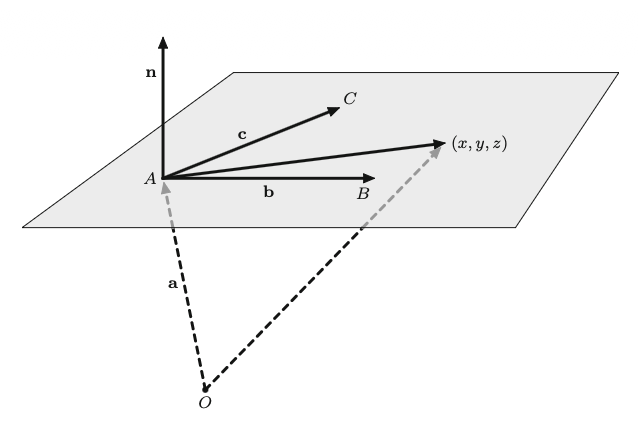

# Analytic Geometry

[Analytic geometry](https://mathworld.wolfram.com/AnalyticGeometry.html) is the study of geometry in 2D and 3D space using coordinate systems and algebraic methods. It provides the geometric framework in which linear algebra operates, giving visual and spatial meaning to vectors, matrices, and linear transformations.

In this section we will cover the more elementary aspects of analytic geometry in relation to the basic components of linear algebra (vectors and matrices). In particular, it covers the geometric interpretation of vectors in coordinate systems, equations for planes in three-dimensional space, and the linear transformations that operate on these geometric objects. A more detailed description of linear algebra in 2D and 3D space can be found in the next chapter entitled _Geometry_.

## Vectors in Coordinate Systems

While [Vectors](01 Vectors.md) covers the algebraic properties of vectors, here we focus on their geometric interpretation in coordinate systems — vectors as directed distances between points.

### Vectors as Directed Distances

A vector in $\mathbb{R}^2$ represents a directed distance: starting from any point, move $a_1$ steps horizontally and $a_2$ steps vertically to reach the endpoint. The vector $\mathbf{a}$ can be drawn anywhere in the plane and records only these displacements — not the starting point: $$\mathbf{a} = \begin{pmatrix} a_1 \\ a_2 \end{pmatrix}$$

In $\mathbb{R}^3$, starting from any point, move $a_1$ steps horizontally, $a_2$ steps vertically, and $a_3$ steps in depth to reach the endpoint. Here too, the vector can be drawn anywhere in space: $$\mathbf{a} = \begin{pmatrix} a_1 \\ a_2 \\ a_3 \end{pmatrix}$$

### Connecting Vectors

Given two points $A = (x_A, y_A)$ and $B = (x_B, y_B)$, the [connecting vector](https://mathworld.wolfram.com/Vector.html) $\vec{AB}$ is the displacement needed to travel from point $A$ to $B$: $$\vec{AB} = \begin{pmatrix} x_B - x_A \\ y_B - y_A \end{pmatrix}$$

In $\mathbb{R}^3$, for points $A = (x_A, y_A, z_A)$ and $B = (x_B, y_B, z_B)$: $$\vec{AB} = \begin{pmatrix} x_B - x_A \\ y_B - y_A \\ z_B - z_A \end{pmatrix}$$

**2D Example:** For $A = (1, 2)$ and $B = (3, 5)$, the connecting vector is $\vec{AB} = \begin{pmatrix} 2 \\ 3 \end{pmatrix}$ — move 2 steps horizontally and 3 steps vertically.

**3D Example:** For $A = (1, 2, 3)$ and $B = (4, 0, 1)$, the connecting vector is $\vec{AB} = \begin{pmatrix} 3 \\ -2 \\ -2 \end{pmatrix}$ — move 3 steps horizontally, 2 steps down, and 2 steps back in depth.

The connecting vector depends on both $A$ and $B$ — choosing a different starting point gives a different displacement. What defines the vector is the relative displacement between the two points, not their absolute positions: shifting both $A$ and $B$ by the same amount leaves $\vec{AB}$ unchanged.

### Position Vectors

A [position vector](https://mathworld.wolfram.com/PositionVector.html) (or _location vector_) is the special case where the starting point is the origin $O$. The position vector of a point $A = (x_A, y_A)$ is: $$\vec{OA} = \begin{pmatrix} x_A \\ y_A \end{pmatrix}$$

The position vector has the same coordinates as the point itself — it describes how to travel from the origin to the given location.

In $\mathbb{R}^3$, the position vector of $A = (x_A, y_A, z_A)$ is: $$\vec{OA} = \begin{pmatrix} x_A \\ y_A \\ z_A \end{pmatrix}$$

Any connecting vector can be expressed as the difference of two position vectors: $\vec{AB} = \vec{OB} - \vec{OA}$. We need to point out a subtle distinction — $A$ and $B$ are _points_ (locations in space), while $\vec{OA}$ and $\vec{OB}$ are _vectors_ (displacements from the origin). The statement above is referring to vector subtraction, not point subtraction: it is the vectors that carry the arithmetic, not the points themselves.

### Geometric Interpretation of Operations

Vector operations have direct geometric meaning in coordinate systems:

- **Negation:** $-\mathbf{a}$ reverses the direction of $\mathbf{a}$. If $\mathbf{a} = \vec{AB}$ then $-\mathbf{a} = \vec{BA}$
- **Scalar multiplication:** $\lambda \mathbf{a}$ stretches $\mathbf{a}$ by factor $\lvert \lambda \rvert$ in the same direction (if $\lambda > 0$) or the opposite direction (if $\lambda < 0$)
- **Addition:** To compute $\mathbf{a} + \mathbf{b}$ geometrically, place the start of $\mathbf{b}$ at the end of $\mathbf{a}$; the sum is the vector from the start of $\mathbf{a}$ to the end of $\mathbf{b}$
- **Subtraction:** $\mathbf{a} - \mathbf{b}$ is equivalent to adding the negation: $\mathbf{a} + (-\mathbf{b})$. Geometrically, reverse $\mathbf{b}$ and then add it to $\mathbf{a}$. This is how connecting vectors are computed: $\vec{AB} = \vec{OB} - \vec{OA}$ subtracts two position vectors to produce a displacement

For the algebraic rules behind these operations, see [Vector Operations](01 Vectors.md#Vector-Operations).

## Planes in Space

A [plane](https://mathworld.wolfram.com/Plane.html) in three-dimensional space is uniquely determined by three [non-collinear](https://mathworld.wolfram.com/Collinear.html) points. Plane equations come in two forms: the _parameterized form_ using direction vectors, and the _parameter-free form_ using a normal vector.

### Parameterized Form

#### Definition

Given three non-collinear points $A$, $B$, and $C$ in $\mathbb{R}^3$, any point $\mathbf{x}$ on the plane through them can be written as: $$\mathbf{x} = \mathbf{a} + \lambda \mathbf{b} + \mu \mathbf{c}$$ where:

- The position vector of $A$ is $\mathbf{a} = \vec{OA}$ where $O$ is the origin point $(0, 0, 0)$
- The connecting vector from $A$ to $B$ is $\mathbf{b} = \vec{AB}$
- The connecting vector from $A$ to $C$ is $\mathbf{c} = \vec{AC}$
- The free parameters are $\lambda, \mu \in \mathbb{R}$

The vectors $\mathbf{b}$ and $\mathbf{c}$ _span_ the plane — every point on the plane can be reached from $A$ by some linear combination of these two direction vectors.

#### Derivation

In order to derive the parameterized form equation, let's look at the diagram above. First, we have the three points $A$, $B$ and $C$ which lie in the plane. And we want to define the vector from $O$ to any arbitrary point $P = (x, y, z)$ in the same plane as $A$. Using the origin $O = (0, 0, 0)$ we can write the equation $\vec{OP} = \vec{OA} + \vec{AP}$ that is we go from the origin to point A and from A we travel to the arbitrary point P on the same plane. Since $\vec{AB}$ and $\vec{AC}$ also lie on the same plane, $\vec{AP} = \lambda \vec{AB} + \mu \vec{AC}$. This directly leads to the equation defined in the previous section.

#### Example

For the plane through $A = (1, 2, 3)$, $B = (0, 1, 2)$, and $C = (-1, 2, 1)$:

$$\begin{aligned}
\mathbf{a} &= \begin{pmatrix} 1 \\ 2 \\ 3 \end{pmatrix}, \quad
\mathbf{b} = \vec{AB} = \begin{pmatrix} -1 \\ -1 \\ -1 \end{pmatrix}, \quad
\mathbf{c} = \vec{AC} = \begin{pmatrix} -2 \\ 0 \\ -2 \end{pmatrix}
\end{aligned}$$

The parameterized equation is: $$\begin{pmatrix} x \\ y \\ z \end{pmatrix} = \begin{pmatrix} 1 \\ 2 \\ 3 \end{pmatrix} + \lambda \begin{pmatrix} -1 \\ -1 \\ -1 \end{pmatrix} + \mu \begin{pmatrix} -2 \\ 0 \\ -2 \end{pmatrix}$$

Setting $\lambda = 0, \mu = 0$ gives the point $(1, 2, 3) = A$ itself.

### Parameter-Free Form

#### Normal Vectors

A [normal vector](https://mathworld.wolfram.com/NormalVector.html) $\mathbf{n}$ to a plane is a vector that is [perpendicular](01 Vectors.md#Orthogonal-and-Orthonormal-Vectors) to every vector lying in the plane.

The normal vector can be found by solving a derived [system of linear equations](03 Systems of Equations.md) as shown in the example below. Or, more directly, by using the cross product described in the next section.

**Example** Let's return to the example used in the Parameterized Form section [above](#Example). See the diagram in the [Derivation](#Derivation) section. We have two vectors in the plane from the example:

$$\begin{aligned}
\mathbf{b} = \vec{AB} = \begin{pmatrix} -1 \\ -1 \\ -1 \end{pmatrix}, \quad
\mathbf{c} = \vec{AC} = \begin{pmatrix} -2 \\ 0 \\ -2 \end{pmatrix}
\end{aligned}$$

The diagram also indicates the normal vector $\mathbf{n} = \begin{pmatrix} n_1 \\ n_2 \\ n_3 \end{pmatrix}$.

Recall that two vectors are perpendicular if and only if their [dot product](01 Vectors.md#Dot-Product) is zero ($\mathbf{a} \cdot \mathbf{b} = 0$) which holds in both $\mathbb{R}^2$ and $\mathbb{R}^3$. Hence, for the plane spanned by $\mathbf{b}$ and $\mathbf{c}$, the normal vector must satisfy both $\mathbf{n} \cdot \mathbf{b} = 0$ and $\mathbf{n} \cdot \mathbf{c} = 0$. Thus:

$$\begin{aligned}
0 = \mathbf{n} \cdot \mathbf{b} = \begin{pmatrix} n_1 \\ n_2 \\ n_3 \end{pmatrix} \cdot \begin{pmatrix} -1 \\ -1 \\ -1 \end{pmatrix} = -n_1-n_2-n_3 \\
0 = \mathbf{n} \cdot \mathbf{c} = \begin{pmatrix} n_1 \\ n_2 \\ n_3 \end{pmatrix} \cdot \begin{pmatrix} -2 \\ 0 \\ -2 \end{pmatrix} = -2n_1-2n_3
\end{aligned}$$

This gives us a linear system of two equations in three unknowns and can be solved using the techniques described in the [System of Equations](03 Systems of Equations.md).

#### Cross Product

The [cross product](https://mathworld.wolfram.com/CrossProduct.html) (vector product) of two 3D vectors $\mathbf{b}$ and $\mathbf{c}$ gives a vector perpendicular to both: $$\mathbf{b} \times \mathbf{c} = \begin{pmatrix} b_2c_3 - b_3c_2 \\ b_3c_1 - b_1c_3 \\ b_1c_2 - b_2c_1 \end{pmatrix}$$

The cross product provides the normal vector directly without solving a system of equations.

If the cross product yields the zero vector, the three points are [collinear](https://mathworld.wolfram.com/Collinear.html) (lie on a line) and no unique plane exists.

**Example (continued):** Using the vectors from above:

$$\mathbf{n} = \mathbf{b} \times \mathbf{c} = \begin{pmatrix} -1 \\ -1 \\ -1 \end{pmatrix} \times \begin{pmatrix} -2 \\ 0 \\ -2 \end{pmatrix} = \begin{pmatrix} (-1)(-2) - (-1)(0) \\ (-1)(-2) - (-1)(-2) \\ (-1)(0) - (-1)(-2) \end{pmatrix} = \begin{pmatrix} 2 \\ 0 \\ -2 \end{pmatrix}$$

#### Parameter-Free Plane Equation

Since the normal vector $\mathbf{n}$ is perpendicular to the entire plane, it is perpendicular to the connecting vector from any fixed plane point $A$ to any other plane point $(x, y, z)$. This gives: $$\mathbf{n} \cdot (\mathbf{x} - \mathbf{a}) = 0$$

Expanding the dot product produces an equation of the form $ax + by + cz = d$, called the _parameter-free_ equation of the plane (it contains no parameters $\lambda$ or $\mu$, only coordinates).

**Example (continued):**

$$\begin{pmatrix} 2 \\ 0 \\ -2 \end{pmatrix} \cdot \begin{pmatrix} x - 1 \\ y - 2 \\ z - 3 \end{pmatrix} = 2(x - 1) + 0(y - 2) - 2(z - 3) = 2x - 2z + 4 = 0$$

Simplifying: $x - z = -2$

Every point $(x, y, z)$ on this plane satisfies $x - z = -2$.

#### Summary of the procedure

To find the parameter-free equation from three non-collinear points $A$, $B$, $C$:

1. Compute direction vectors: $\mathbf{b} = \vec{AB}$ and $\mathbf{c} = \vec{AC}$
2. Find the normal vector: $\mathbf{n} = \mathbf{b} \times \mathbf{c}$
3. Form the equation: $\mathbf{n} \cdot (\mathbf{x} - \mathbf{a}) = 0$
4. Expand and simplify to get $ax + by + cz = d$

## Linear Transformations

[Linear transformations](https://mathworld.wolfram.com/LinearTransformation.html) are functions between vector spaces that preserve vector addition and scalar multiplication. They are the fundamental operations studied in linear algebra and can all be represented by [matrices](02 Matrices.md).

### Definition

A function $T: \mathbb{R}^n \to \mathbb{R}^m$ is a **linear transformation** if for all vectors $\mathbf{u}, \mathbf{v}$ and all scalars $c$:

1. **Additivity:** $T(\mathbf{u} + \mathbf{v}) = T(\mathbf{u}) + T(\mathbf{v})$
2. **Homogeneity:** $T(c\mathbf{v}) = cT(\mathbf{v})$

These two properties can be combined: $$T(c_1\mathbf{v}_1 + c_2\mathbf{v}_2) = c_1T(\mathbf{v}_1) + c_2T(\mathbf{v}_2)$$

**Important consequence:** Every linear transformation maps the zero vector to itself: $$T(\mathbf{0}) = \mathbf{0}$$

### Matrix Representation

Every linear transformation $T: \mathbb{R}^n \to \mathbb{R}^m$ can be represented by an $m \times n$ matrix $A$: $$T(\mathbf{v}) = A\mathbf{v}$$

#### Finding the Matrix

To find the matrix for a linear transformation:

1. Apply $T$ to each standard basis vector $\mathbf{e}_1, \mathbf{e}_2, \ldots, \mathbf{e}_n$
2. The columns of $A$ are $T(\mathbf{e}_1), T(\mathbf{e}_2), \ldots, T(\mathbf{e}_n)$

**Example in $\mathbb{R}^2$:**

- $\mathbf{e}_1 = \lbrack 1, 0 \rbrack$ and $\mathbf{e}_2 = \lbrack 0, 1 \rbrack$
- Matrix: $A = \lbrack T(\mathbf{e}_1) \mid T(\mathbf{e}_2) \rbrack$

### Common Transformations in 2D

#### Rotation

A [rotation](https://mathworld.wolfram.com/RotationMatrix.html) by angle $\theta$ (counterclockwise) about the origin:

$$R_\theta = \begin{pmatrix} \cos\theta & -\sin\theta \\ \sin\theta & \cos\theta \end{pmatrix}$$

**Properties:**

- Preserves lengths: $\|R_\theta\mathbf{v}\| = \|\mathbf{v}\|$
- Preserves angles between vectors
- Determinant: $\det(R_\theta) = 1$
- Inverse: $R_\theta^{-1} = R_{-\theta}$

**Derivation:** Apply rotation to basis vectors:

- $R_\theta(\mathbf{e}_1) = \lbrack \cos\theta, \sin\theta \rbrack$
- $R_\theta(\mathbf{e}_2) = \lbrack -\sin\theta, \cos\theta \rbrack$

#### Scaling (Stretch)

A [scaling transformation](https://mathworld.wolfram.com/ScalingMatrix.html) by factor $\lambda$:

$$S_\lambda = \begin{pmatrix} \lambda & 0 \\ 0 & \lambda \end{pmatrix}$$

**Non-uniform scaling** with different factors along axes:

$$S_{\lambda_1, \lambda_2} = \begin{pmatrix} \lambda_1 & 0 \\ 0 & \lambda_2 \end{pmatrix}$$

**Properties:**

- $\lambda > 1$: expansion
- $0 < \lambda < 1$: contraction
- $\lambda < 0$: includes reflection
- Determinant: $\det(S_\lambda) = \lambda^2$

#### Reflection

[Reflection](https://mathworld.wolfram.com/Reflection.html) across a line through the origin with direction $\mathbf{u} = \lbrack \cos\phi, \sin\phi \rbrack$:

$$M_\phi = \begin{pmatrix} \cos 2\phi & \sin 2\phi \\ \sin 2\phi & -\cos 2\phi \end{pmatrix}$$

**Special cases:**

- Reflection across x-axis ($\phi = 0$): $\begin{pmatrix} 1 & 0 \\ 0 & -1 \end{pmatrix}$
- Reflection across y-axis ($\phi = \frac{\pi}{2}$): $\begin{pmatrix} -1 & 0 \\ 0 & 1 \end{pmatrix}$
- Reflection across $y = x$ ($\phi = \frac{\pi}{4}$): $\begin{pmatrix} 0 & 1 \\ 1 & 0 \end{pmatrix}$

**Properties:**

- $M_\phi^2 = I$ (applying twice returns to original)
- Determinant: $\det(M_\phi) = -1$
- Preserves lengths

#### Orthogonal Projection

[Projection](https://mathworld.wolfram.com/Projection.html) onto a line through the origin with unit direction $\mathbf{u} = \lbrack \cos\phi, \sin\phi \rbrack$:

$$P_\phi = \begin{pmatrix} \cos^2\phi & \cos\phi\sin\phi \\ \cos\phi\sin\phi & \sin^2\phi \end{pmatrix}$$

**Alternative form:** For projection onto line spanned by unit vector $\mathbf{u}$: $$P = \mathbf{u}\mathbf{u}^T$$

**Properties:**

- $P^2 = P$ (idempotent: projecting twice gives same result)
- Determinant: $\det(P) = 0$ (rank 1)
- Eigenvalues: 1 and 0

#### Shear

A [shear transformation](https://mathworld.wolfram.com/Shear.html) parallel to the x-axis:

$$H_k = \begin{pmatrix} 1 & k \\ 0 & 1 \end{pmatrix}$$

Shear parallel to the y-axis:

$$H'_k = \begin{pmatrix} 1 & 0 \\ k & 1 \end{pmatrix}$$

**Properties:**

- Preserves area: $\det(H_k) = 1$
- Does not preserve angles or lengths (except along the shear axis)

### Composition of Transformations

#### Matrix Multiplication

Applying transformation $T_B$ followed by $T_A$ is equivalent to: $$T_A(T_B(\mathbf{v})) = (AB)\mathbf{v}$$

**Important:** Matrix multiplication is not commutative: $AB \neq BA$ in general.

The order matters: "First $B$, then $A$" corresponds to $AB$.

#### Examples

**Rotation then scaling:**

$$S_\lambda R_\theta = \begin{pmatrix} \lambda\cos\theta & -\lambda\sin\theta \\ \lambda\sin\theta & \lambda\cos\theta \end{pmatrix}$$

**Two rotations:**

$$R_\alpha R_\beta = R_{\alpha + \beta}$$

Rotations commute with each other.

### Properties of Linear Transformations

#### Kernel (Null Space)

The [kernel](https://mathworld.wolfram.com/NullSpace.html) of $T$ is the set of vectors mapped to zero: $$\ker(T) = \{\mathbf{v} : T(\mathbf{v}) = \mathbf{0}\}$$

- If $\ker(T) = \{\mathbf{0}\}$, then $T$ is one-to-one (injective)
- The dimension of the kernel is the nullity

#### Image (Range)

The [image](https://mathworld.wolfram.com/Range.html) of $T$ is the set of all possible outputs: $$\text{im}(T) = \{T(\mathbf{v}) : \mathbf{v} \in \mathbb{R}^n\}$$

- The dimension of the image is the rank
- **Rank-Nullity Theorem:** $\text{rank}(T) + \text{nullity}(T) = n$

#### Invertibility

A linear transformation $T: \mathbb{R}^n \to \mathbb{R}^n$ is [invertible](https://mathworld.wolfram.com/MatrixInverse.html) if and only if:

- $\ker(T) = \{\mathbf{0}\}$ (one-to-one)
- $\text{im}(T) = \mathbb{R}^n$ (onto)
- $\det(A) \neq 0$

The inverse transformation has matrix $A^{-1}$.

### Geometric Interpretation

#### Effect on Unit Circle

The unit circle transforms to an ellipse under most linear transformations. The semi-axes of the ellipse are related to the [singular values](https://mathworld.wolfram.com/SingularValue.html) of the matrix.

#### Determinant and Area

The [determinant](https://mathworld.wolfram.com/Determinant.html) of a transformation matrix measures how areas scale:

- $|\det(A)|$ = factor by which areas are multiplied
- $\det(A) > 0$: orientation preserved
- $\det(A) < 0$: orientation reversed

## Applications

### Analytic Geometry

- **Architecture and engineering:** Plane equations describe surfaces, walls, and structural elements
- **Computer-aided design (CAD):** Representing and intersecting planes for 3D modeling
- **Navigation and GPS:** Position vectors and coordinate calculations for locating points in space

### Computer Graphics

- **Model transformations:** Position, rotate, and scale objects
- **View transformations:** Camera positioning
- **Homogeneous coordinates:** Enable translation as a linear transformation

### Physics

- **Coordinate transformations:** Changing reference frames
- **Stress and strain tensors:** Material deformation
- **Quantum mechanics:** Operators on state spaces

### Data Science

- **Principal Component Analysis (PCA):** Finding directions of maximum variance
- **Dimensionality reduction:** Projecting high-dimensional data

## See Also

- [Vectors](01 Vectors.md) - Vector operations and algebraic properties
- [Matrices](02 Matrices.md) - Matrix operations and properties
- [Systems of Equations](03 Systems of Equations.md) - Solving linear systems
- [Lines](../Geometry/02 Lines.md) - Parametric and implicit line representations
- [Vectors and Geometry](../Geometry/03 Vectors and Geometry.md) - Geometric interpretation of vectors
- [Matrices](02 Matrices.md) - Matrix operations and properties
