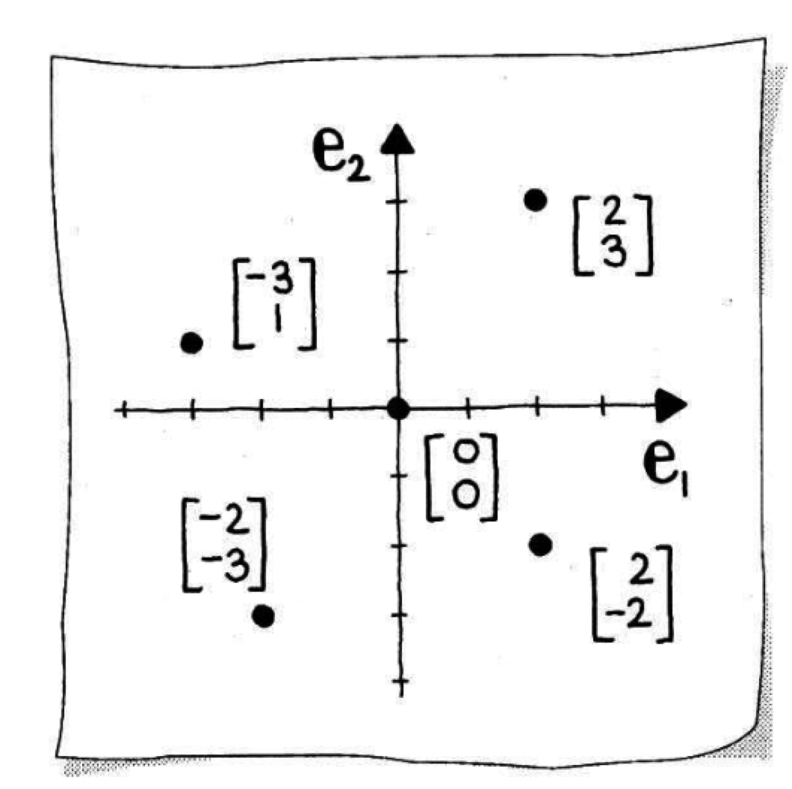
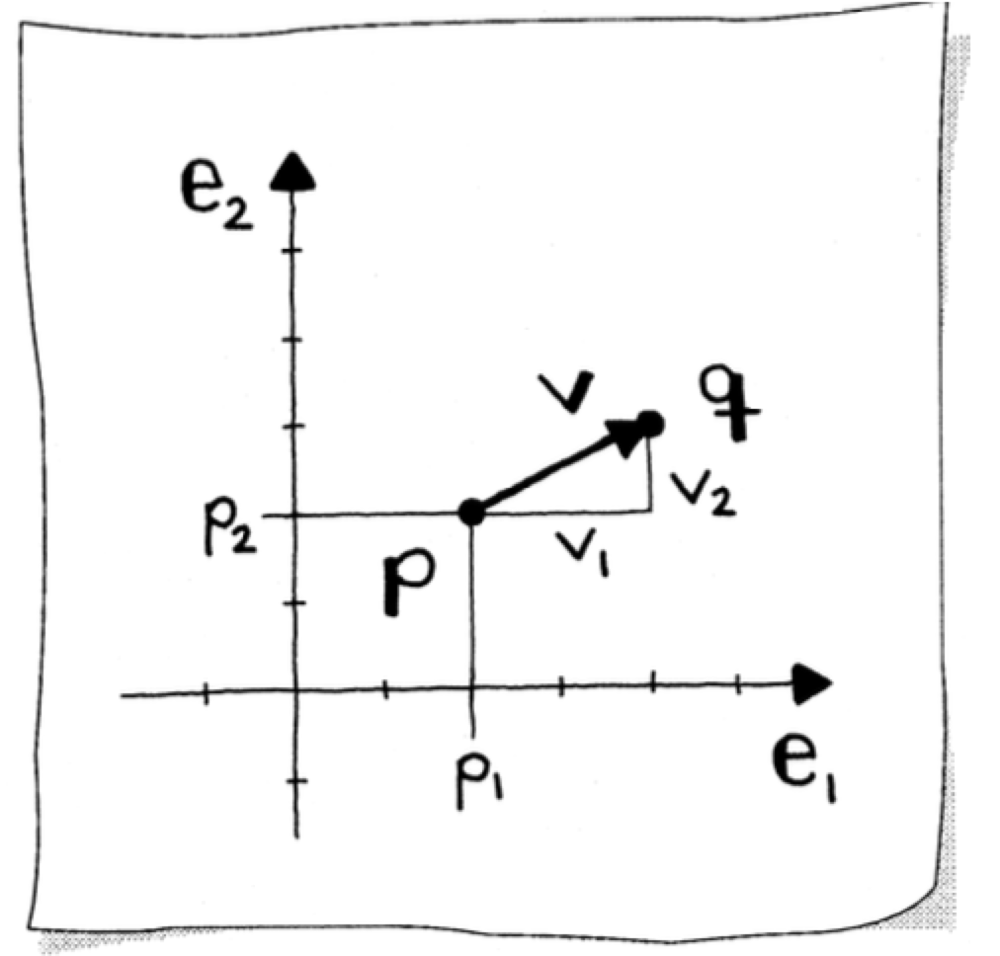
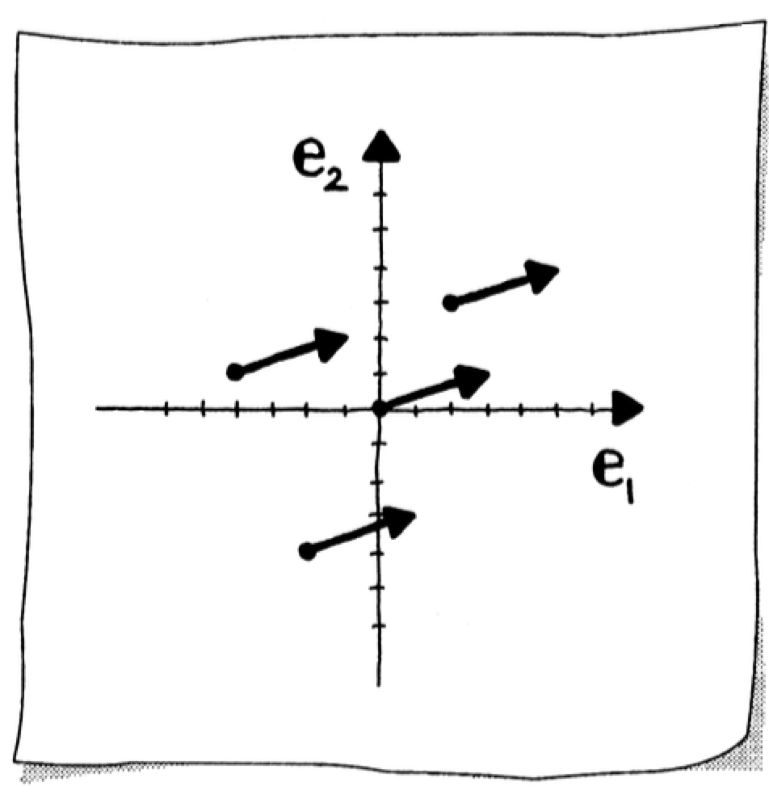
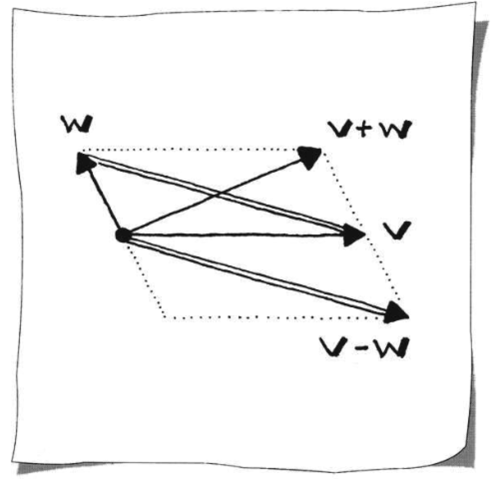
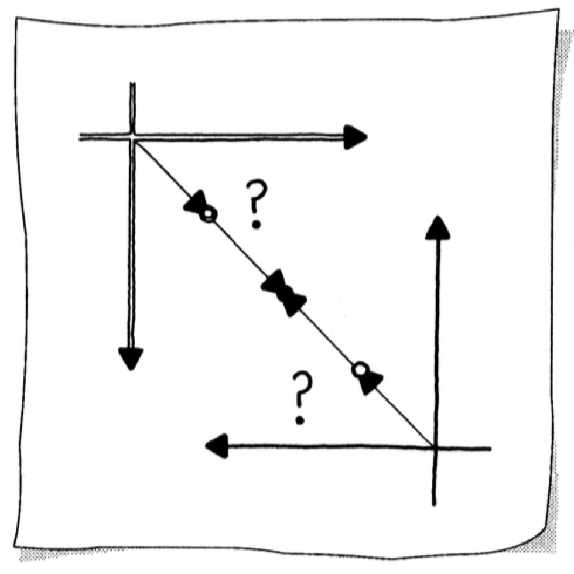
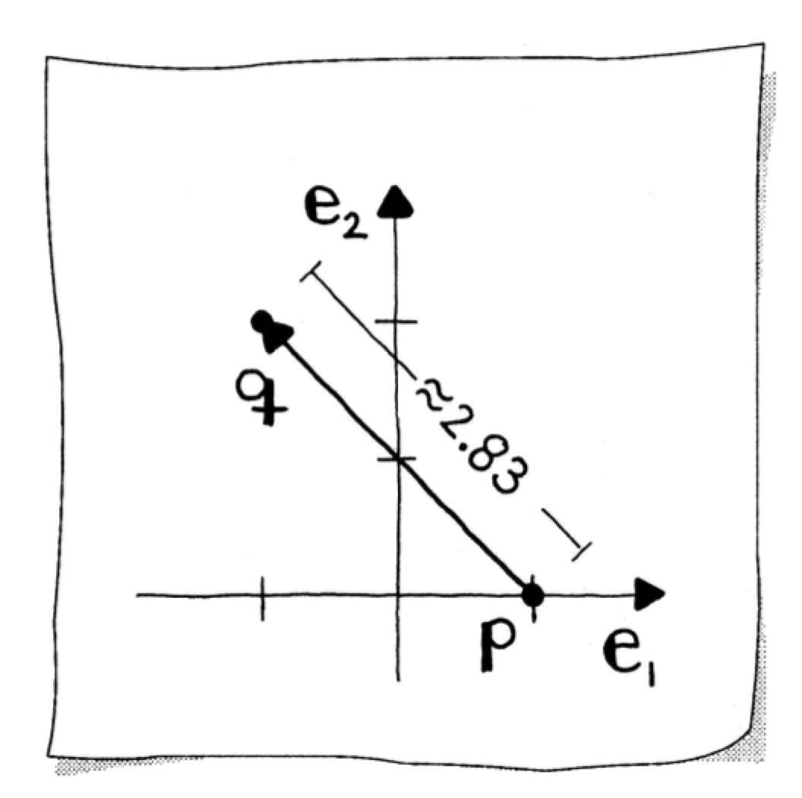
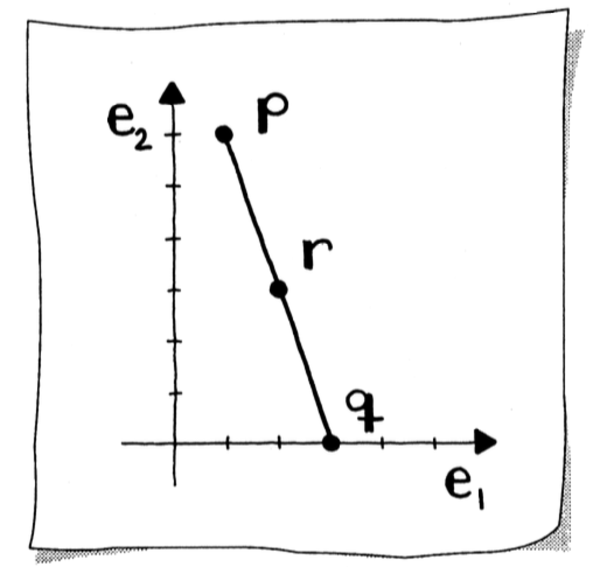
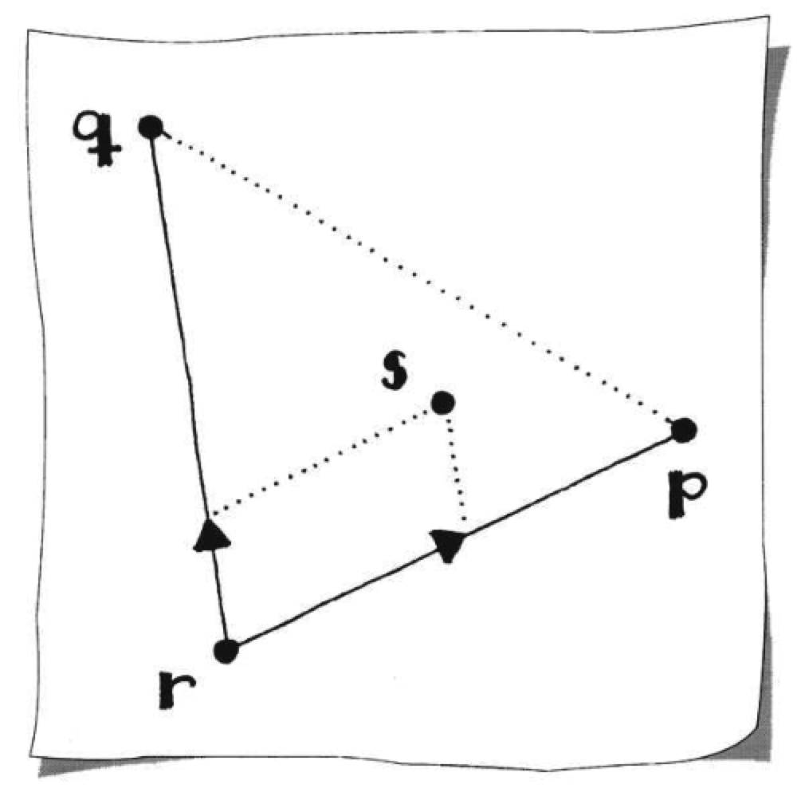

# Points and Coordinates

This section introduces the fundamental geometric entities of [points](https://mathworld.wolfram.com/Point.html) and [vectors](https://mathworld.wolfram.com/Vector.html), their mathematical representations, and coordinate systems used in linear algebra.

## Euclidean Space and Coordinate Systems

### The Number Line and Coordinates

Suppose $P$ is a point on the number line that is located $x$ units to the right of the origin $O$. Then $x$ is called the _coordinate_ of $P$, and $P$ is called the _graph_ of $x$.

Suppose $Q$ is a point on the number line that is located $x$ units to the left of $O$. Its distance from $O$ is still $x$, but it's not the same point as $P$. In this case, $-x$ is the coordinate of $Q$, and $Q$ is the graph of $-x$.

### The Cartesian Plane

This idea of relating the set of all points on a line with the real numbers goes back to antiquity, but it was not until the 17th century that mathematicians (notably Descartes and Fermat) developed a clear notion of how to coordinatize a plane: draw two perpendicular coordinatized lines (usually with the same scale on each) that intersect at their common origin. These lines are called the **x-axis** and **y-axis**. You can now uniquely identify every point on the plane using an ordered pair of numbers. If the point $P$ corresponds to the ordered pair $(x, y)$, then $x$ and $y$ are the [coordinates](https://mathworld.wolfram.com/Coordinates.html) of $P$.

## Points

The most basic geometric entity is the _point_. A [point](https://mathworld.wolfram.com/Point.html) is a reference to a _location_.

The location of $\mathbf{p}$ is $p_1$-units along the $\mathbf{e}_1$-axis and $p_2$-units along the $\mathbf{e}_2$-axis. A point's coordinates, $p_1$ and $p_2$, are dependent upon the location of the coordinate origin, denoted as:

$$\mathbf{o}=\left\lbrack\begin{array}{l}
0 \\
0
\end{array}\right\rbrack$$

We use boldface notation so there is a noticeable difference between a one-dimensional (1D) number, or _scalar_ $p$, and a point $\mathbf{p}$.

To clearly identify $\mathbf{p}$ as a point, the notation $\mathbf{p} \in \mathbb{E}^2$ is used. This means that a 2D point "lives" in 2D [Euclidean space](https://mathworld.wolfram.com/EuclideanSpace.html) $\mathbb{E}^2$.



## Vectors

Suppose the reference point is $\mathbf{p}$, and when moving along a straight path, our target point is $\mathbf{q}$. The direction from $\mathbf{p}$ would be to follow the [vector](https://mathworld.wolfram.com/Vector.html) $\mathbf{v}$. Our notation for a vector is the same as for a point: boldface lowercase letters.

For algebraic properties of vector operations (addition, scalar multiplication, dot product), see [Vectors](../Basics/01 Vectors.md).

To get to $\mathbf{q}$ we say:

$$\mathbf{q}=\mathbf{p}+\mathbf{v}$$

To calculate this, add each component separately:

$$\left\lbrack\begin{array}{l}
q_1 \\
q_2
\end{array}\right\rbrack=\left\lbrack\begin{array}{l}
p_1 \\
p_2
\end{array}\right\rbrack+\left\lbrack\begin{array}{l}
v_1 \\
v_2
\end{array}\right\rbrack=\left\lbrack\begin{array}{l}
p_1+v_1 \\
p_2+v_2
\end{array}\right\rbrack$$

For example:

$$\left\lbrack\begin{array}{l}
4 \\
3
\end{array}\right\rbrack=\left\lbrack\begin{array}{l}
2 \\
2
\end{array}\right\rbrack+\left\lbrack\begin{array}{l}
2 \\
1
\end{array}\right\rbrack$$



### Vectors as Displacement

The components of $\mathbf{v}$, namely $v_1$ and $v_2$, indicate how many units to move along the $\mathbf{e}_1$- and $\mathbf{e}_2$-axis, respectively. This means that $\mathbf{v}$ can be defined as:

$$\mathbf{v}=\mathbf{q}-\mathbf{p}$$

This defines a vector as a difference of two points which describes a _direction_ and a _distance_, or a _displacement_. The vector $\overrightarrow{PQ} = \mathbf{q} - \mathbf{p}$ is called the [displacement vector](https://mathworld.wolfram.com/DisplacementVector.html) from $\mathbf{p}$ to $\mathbf{q}$.

A vector has a _tail_ and a _head_. The tail is typically displayed positioned at a point, or bound to a point, to indicate the geometric significance of the vector. However, unlike a point, a vector does not define a position. Two vectors are equal if they have the same component values, just as points are equal if they have the same coordinate values. Thus, considering a vector as a difference of two points, there are any number of vectors with the same direction and length.



### Position Vectors and Free Vectors

A [position vector](https://mathworld.wolfram.com/PositionVector.html) is a vector from the origin $\mathbf{o}$ to a point $\mathbf{p}$:

$$\overrightarrow{OP} = \mathbf{p} - \mathbf{o} = \mathbf{p}$$

Since the origin has coordinates $\lbrack 0, 0 \rbrack$, the position vector of a point equals the point's coordinates.

A _free vector_ is defined only by its magnitude and direction, not its starting point. As shown above, any number of vectors can have the same direction and length—these are all equal as free vectors. When we write $\mathbf{v} = \lbrack v_1, v_2 \rbrack$, we typically mean a free vector.

### Special Vectors

A special vector worth mentioning is the [zero vector](https://mathworld.wolfram.com/ZeroVector.html):

$$\mathbf{0}=\left\lbrack\begin{array}{l}
0 \\
0
\end{array}\right\rbrack$$

This vector has no direction or length.

### Parallel Vectors

Two vectors are parallel if one is a scalar multiple of the other: $$\mathbf{u} = c\mathbf{v}$$ for some scalar $c$.

### Standard Basis

Other important vectors include the [standard basis](https://mathworld.wolfram.com/StandardBasisVector.html) vectors:

$$\mathbf{e}_1=\left\lbrack\begin{array}{l}
1 \\
0
\end{array}\right\rbrack \quad \text{and} \quad \mathbf{e}_2=\left\lbrack\begin{array}{l}
0 \\
1
\end{array}\right\rbrack$$

These two vectors form the basis of our 2D representations of points and vectors:

$$\mathbf{p}=\mathbf{o}+p_1 \mathbf{e}_1+p_2 \mathbf{e}_2 \quad \text{and} \quad \mathbf{v}=v_1 \mathbf{e}_1+v_2 \mathbf{e}_2$$

They are often referred to as the _standard basis_ in 2D.

### Vector Spaces

To clearly identify $\mathbf{v}$ as a vector, we write $\mathbf{v} \in \mathbb{R}^2$. This means that a 2D vector "lives" in a 2D [linear space](https://mathworld.wolfram.com/LinearSpace.html) $\mathbb{R}^2$. Other names for $\mathbb{R}^2$ are _real_ or _vector spaces_.

## Points vs Vectors

When writing a point or a vector, we use boldface lowercase letters; when programming, we use the same data structure (e.g., arrays). This makes it appear that points and vectors can be treated in the same manner. **Not so!**

Points and vectors are different geometric entities. This is reiterated by saying they live in different spaces: $\mathbb{E}^2$ and $\mathbb{R}^2$. For convenience and clarity, elements of Euclidean and linear spaces are typically displayed together.

The primary reason for differentiating between points and vectors is to achieve geometric constructions which are **coordinate independent**.

In what follows, let's use $\mathbf{p}, \mathbf{q} \in \mathbb{E}^2$ and $\mathbf{v}, \mathbf{w} \in \mathbb{R}^2$.

### Coordinate Independent Operations

- **Subtracting a point from another** ($\mathbf{p}-\mathbf{q}$) yields a vector

- **Adding or subtracting two vectors** yields another vector. The vectors $\mathbf{v}-\mathbf{w}$ and $\mathbf{v} + \mathbf{w}$ are the diagonals of the parallelogram defined by $\mathbf{v}$ and $\mathbf{w}$. This is a coordinate independent operation since vectors are defined as a difference of points (the [parallelogram rule](https://mathworld.wolfram.com/ParallelogramLaw.html))



- **Multiplying by a scalar** $s$ is called _scaling_. Scaling a vector is a well-defined operation. The result $s\mathbf{v}$ adjusts the length by the scaling factor. The direction is unchanged if $s > 0$ and reversed for $s < 0$. If $s = 0$, then the result is the zero vector.

- **Adding a vector to a point** ($\mathbf{p}+\mathbf{v}$) yields another point.

### Coordinate Dependent Operations

- **Scaling a point** ($s\mathbf{p}$) is not a well-defined operation. Scaling the solid black point by one-half with respect to two different coordinate systems results in two different points.



- **Adding two points** ($\mathbf{p}+\mathbf{q}$) is not a well-defined operation. The result of adding the two solid black points is dependent on the coordinate origin. (The parallelogram rule is used here to construct the results of the additions.)


## Combining Points

### Distance Between Points

To find the distance between two points, we simply form a vector defined by the two points, e.g., $\mathbf{v}=\mathbf{q}-\mathbf{p}$, and apply the [Euclidean norm](https://mathworld.wolfram.com/L2-Norm.html):

$$\lVert\mathbf{v}\rVert=\sqrt{v_1^2+v_2^2}$$

**Example:** Let

$$\mathbf{q}=\left\lbrack\begin{array}{r}
-1 \\
2
\end{array}\right\rbrack \quad \text{and} \quad \mathbf{p}=\left\lbrack\begin{array}{l}
1 \\
0
\end{array}\right\rbrack$$

Then

$$\mathbf{q}-\mathbf{p}=\left\lbrack\begin{array}{r}-2 \\ 2\end{array}\right\rbrack$$

and

$$\lVert\mathbf{q}-\mathbf{p}\rVert=\sqrt{(-2)^2+2^2}=\sqrt{8} \approx 2.83$$



```julia
using GeometryBasics
using LinearAlgebra

function distance_2_points(p::Point, q::Point)
    v = q - p
    norm(v)
end

julia> p = Point(1, 0)
julia> q = Point(-1, 2)
julia> distance_2_points(p, q)
2.8284271247461903
```

### Midpoint of Two Points

There is a way to combine two points such that we get a meaningful third one. Take the example of the midpoint $\mathbf{r}$ of two points $\mathbf{p}$ and $\mathbf{q}$:

$$\mathbf{p}=\left\lbrack\begin{array}{l}1 \\ 6\end{array}\right\rbrack, \quad \mathbf{r}=\left\lbrack\begin{array}{l}2 \\ 3\end{array}\right\rbrack, \quad \mathbf{q}=\left\lbrack\begin{array}{l}3 \\ 0\end{array}\right\rbrack$$

Start with the known coordinate independent operation of adding a vector to a point. Define $\mathbf{r}$ by adding an appropriately scaled version of the vector $\mathbf{v}=\mathbf{q}-\mathbf{p}$ to the point $\mathbf{p}$:

$$\begin{aligned}
\mathbf{r} & =\mathbf{p}+\frac{1}{2} \mathbf{v} \\
\left\lbrack\begin{array}{l}
2 \\
3
\end{array}\right\rbrack & =\left\lbrack\begin{array}{l}
1 \\
6
\end{array}\right\rbrack+\frac{1}{2}\left\lbrack\begin{array}{r}
2 \\
-6
\end{array}\right\rbrack
\end{aligned}$$

Expanding, this shows that $\mathbf{r}$ can also be defined as:

$$\begin{aligned}
\mathbf{r} & =\frac{1}{2} \mathbf{p}+\frac{1}{2} \mathbf{q} \\
\left\lbrack\begin{array}{l}
2 \\
3
\end{array}\right\rbrack & =\frac{1}{2}\left\lbrack\begin{array}{l}
1 \\
6
\end{array}\right\rbrack+\frac{1}{2}\left\lbrack\begin{array}{l}
3 \\
0
\end{array}\right\rbrack
\end{aligned}$$



This is a legal expression for a combination of points.

### Combining Points to Form Vectors

We can also combine points so that the result is a vector. For this, we need the coefficients to sum to zero. Suppose we have the equation:

$$\mathbf{e}=\mathbf{r}-2 \mathbf{p}+\mathbf{q}, \quad \mathbf{r}, \mathbf{p}, \mathbf{q} \in \mathbb{E}^2$$

Does $\mathbf{e}$ have a geometric meaning? Looking at the sum of the coefficients, $1-2+1=0$, we conclude that $\mathbf{e}$ is a vector. By rewriting the equation as:

$$\mathbf{e}=(\mathbf{r}-\mathbf{p})+(\mathbf{q}-\mathbf{p})$$

it is clear that $\mathbf{e}$ is a vector formed from (vector + vector).

## Barycentric Coordinates

Adding a (scaled) vector to a point is a well-defined, coordinate independent operation that yields another point. Any point of the form:

$$\mathbf{r}=\mathbf{p}+t \mathbf{v}$$

is on the line through $\mathbf{p}$ and $\mathbf{q}$. We may rewrite this as:

$$\mathbf{r}=\mathbf{p}+t(\mathbf{q}-\mathbf{p})$$

and then:

$$\mathbf{r}=(1-t) \mathbf{p}+t \mathbf{q}$$

The scalar values $(1-t)$ and $t$ are _coefficients_. A weighted sum of points where the coefficients sum to one is called a [barycentric combination](https://mathworld.wolfram.com/BarycentricCoordinates.html). In this special case, where one point $\mathbf{r}$ is being expressed in terms of two others, $\mathbf{p}$ and $\mathbf{q}$, the coefficients $1-t$ and $t$ are called the _barycentric coordinates_ of $\mathbf{r}$.

### Linear Interpolation

A barycentric combination allows us to construct $\mathbf{r}$ anywhere on the line defined by $\mathbf{p}$ and $\mathbf{q}$. This is why $\mathbf{r}$ is also called _linear interpolation_.

- **Convex combinations**: To restrict $\mathbf{r}$'s position to the line segment between $\mathbf{p}$ and $\mathbf{q}$, we allow only values where $0 \leq t \leq 1$
- **Extrapolation**: To define points outside of the line segment between $\mathbf{p}$ and $\mathbf{q}$, we need values of $t<0$ or $t>1$

### Ratio and Center of Gravity

The position of $\mathbf{r}$ is said to be in the ratio of $t:(1-t)$ or $t/(1-t)$. In physics, $\mathbf{r}$ is known as the [center of gravity](https://mathworld.wolfram.com/CenterofGravity.html) of two points $\mathbf{p}$ and $\mathbf{q}$ with weights $1-t$ and $t$, respectively.

From a constructive approach, the ratio is formed from the quotient:

$$\text{ratio}=\frac{\lVert\mathbf{r}-\mathbf{p}\rVert}{\lVert\mathbf{q}-\mathbf{r}\rVert}$$

### Parameter Definition

The barycentric coordinate $t$ is also called a _parameter_. This parameter is defined by the quotient:

$$t=\frac{\lVert\mathbf{r}-\mathbf{p}\rVert}{\lVert\mathbf{q}-\mathbf{p}\rVert}$$

```julia
function center_of_gravity(p::Point, q::Point, t::Float64)
    v = q - p
    r = p + (t * v)
end

function barycentric_coord(p::Point, q::Point, r::Point)
    t = norm(r - p) / norm(q - r)
end

julia> p = Point(2, 2)
julia> q = Point(6, 4)
julia> r = center_of_gravity(p, q, 2.0)
Point2{Float64}(10.0, 6.0)

julia> barycentric_coord(p, q, r)
2.0
```

### Barycentric Combinations with Three Points

We can create barycentric combinations with more than two points. Consider three points $\mathbf{p}$, $\mathbf{q}$, and $\mathbf{r}$ which are not collinear. Any point $\mathbf{s}$ can be formed from:

$$\mathbf{s}=\mathbf{r}+t_1(\mathbf{p}-\mathbf{r})+t_2(\mathbf{q}-\mathbf{r})$$

This is a coordinate independent operation of point + vector + vector. Expanding and regrouping, we can also define $\mathbf{s}$ as:

$$\begin{aligned}
\mathbf{s} & =t_1 \mathbf{p}+t_2 \mathbf{q}+\left(1-t_1-t_2\right) \mathbf{r} \\
& =t_1 \mathbf{p}+t_2 \mathbf{q}+t_3 \mathbf{r}
\end{aligned}$$

Thus, the point $\mathbf{s}$ is defined by barycentric combination with coefficients $t_1$, $t_2$, and $t_3=1-t_1-t_2$ with respect to $\mathbf{p}$, $\mathbf{q}$, and $\mathbf{r}$, respectively.



## Point-Tester Equations

Identifying $\mathbb{R}^2$ with a plane provides a way to use algebra to describe geometric objects. This is the central theme of [analytic geometry](https://mathworld.wolfram.com/AnalyticGeometry.html).

Consider the circle $C$. You can describe $C$ geometrically by saying that $C$ consists of all points in the plane that are 1 unit from the origin $O$. However, you can also describe $C$ algebraically in terms of the coordinates of the points that lie on $C$: the circle $C$ is the set of points $(x, y)$ so that $x^2+y^2=1$.

The connection between the geometric description ("$C$ consists of all points...") and the equation ("$x^2+y^2=1$") is that the equation is a _point-tester_ for the geometric definition. This means you can test a point to see if it's on the circle by checking if its coordinates satisfy the equation.

**Example:** Test if the point $\left(\frac{\sqrt{2}}{2}, \frac{\sqrt{2}}{2}\right)$ lies on the unit circle:

$$\left(\frac{\sqrt{2}}{2}\right)^2 + \left(\frac{\sqrt{2}}{2}\right)^2 = \frac{1}{2} + \frac{1}{2} = 1 \quad \checkmark$$

This approach generalizes to any geometric object: lines, ellipses, parabolas, and more complex curves can all be described by point-tester equations.
