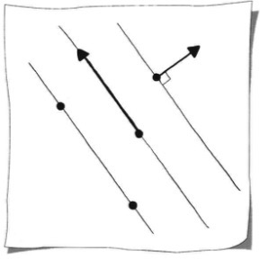
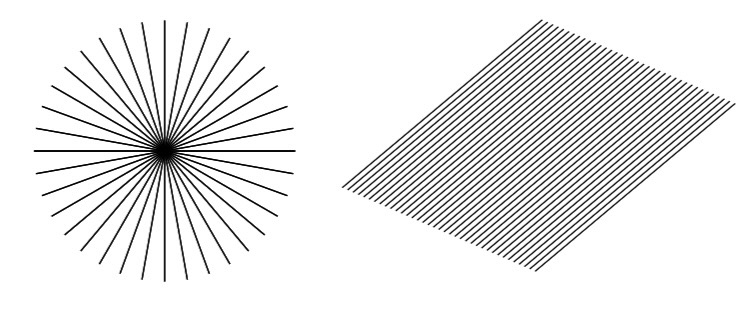
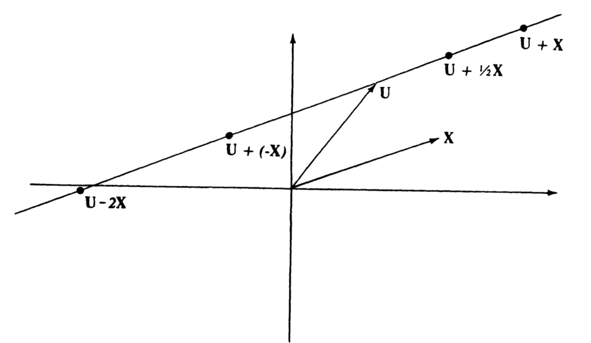
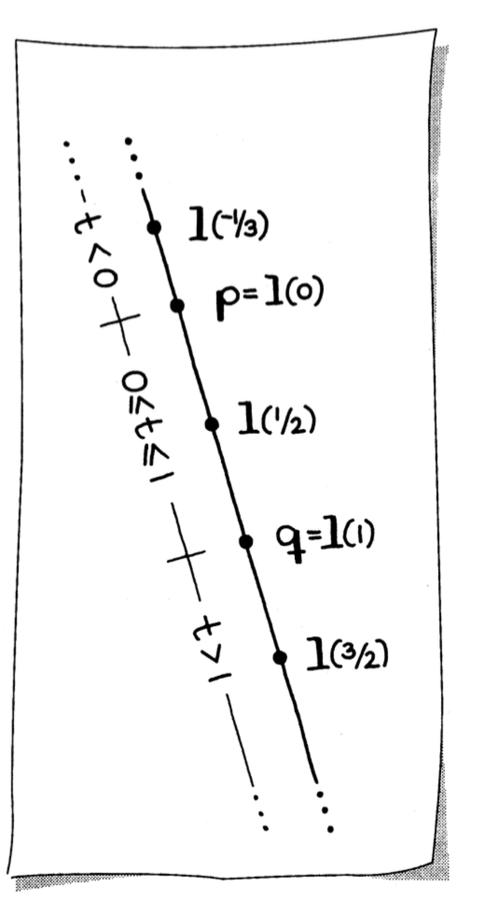
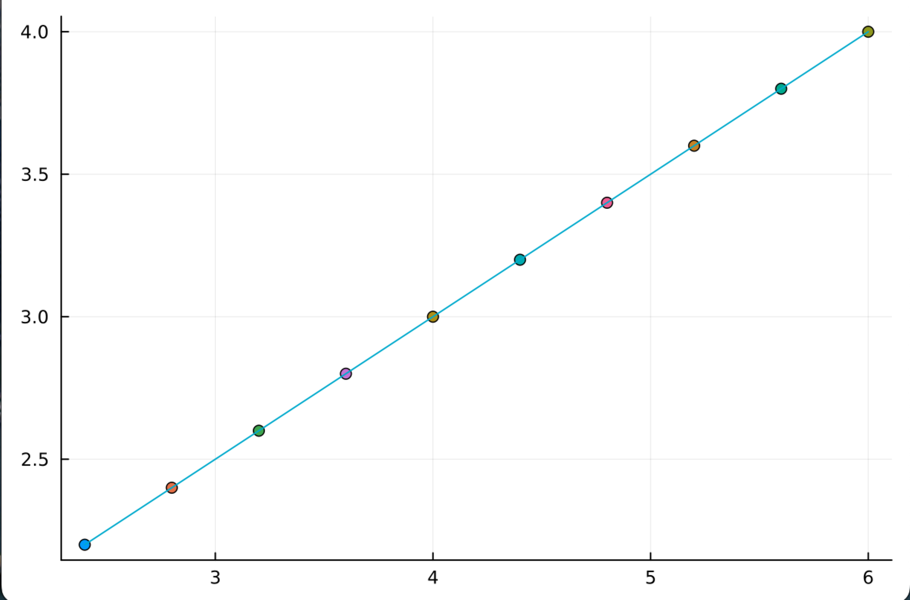
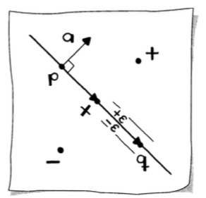
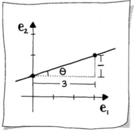
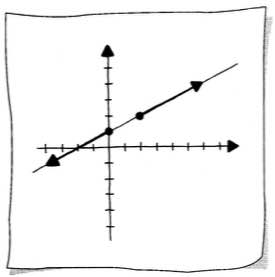

# Lines

A [line](https://mathworld.wolfram.com/Line.html) in $\mathbb{R}^2$ is one of the fundamental objects in linear algebra and geometry. This document covers the three standard representations of a line—parametric, implicit, and explicit—along with methods to convert between them.

## Defining a Line

Two elements of 2D geometry define a [line](https://mathworld.wolfram.com/Line.html):

- Two points
- A point and a vector parallel to the line
- A point and a vector perpendicular to the line



The unit vector that is perpendicular (or [orthogonal](https://mathworld.wolfram.com/Orthogonal.html)) to a line is referred to as the _normal_ to the line. The figure below shows two families of lines: one family of lines shares a common point and the other family of lines shares the same normal.



Just as there are different ways to specify a line geometrically, there are different mathematical representations: _parametric_, _implicit_, and _explicit_.

## Parametric Form

### Parametric Representation

Just as the multiples $t \mathbf{X}$ of a nonzero vector $\mathbf{X}$ give a description of a line through the origin, we may describe a line through a point $\mathbf{U}$ parallel to the vector $\mathbf{X}$ by taking the sum of $\mathbf{U}$ and all multiples of $\mathbf{X}$. The line is then given by $\mathbf{U} + t\mathbf{X}$ for all real $t$.



For example, the line through $\mathbf{B} = \lbrack 2, 1 \rbrack^T$ parallel to the vector $\mathbf{A} = \lbrack 3, 1 \rbrack^T$ is given by:

$$\mathbf{X} = \mathbf{B} + t\mathbf{A} = \begin{bmatrix} 2 \\ 1 \end{bmatrix} + t\begin{bmatrix} 3 \\ 1 \end{bmatrix} = \begin{bmatrix} 2 + 3t \\ 1 + t \end{bmatrix}$$

This is called the _[parametric representation](https://mathworld.wolfram.com/ParametricEquations.html)_ of a line in the plane, since the coordinates $x = 2 + 3t$ and $y = 1 + t$ are given as linear functions of the [parameter](https://mathworld.wolfram.com/Parameter.html) $t$.

Similarly, the line given by the parametric equation in coordinates $\lbrack x, y \rbrack^T = \lbrack 3 + 4t, 1 + 2t \rbrack^T$ can be written in vector form as:

$$\mathbf{X} = \begin{bmatrix} 3 \\ 1 \end{bmatrix} + t\begin{bmatrix} 4 \\ 2 \end{bmatrix} = \mathbf{A} + t\mathbf{D}$$

### Parametric Equation of a Line

The _parametric equation of a line_ $\mathbf{l}(t)$ has the form:

$$\mathbf{l}(t) = \mathbf{p} + t\mathbf{v}$$

where $\mathbf{p} \in \mathbb{E}^2$ and $\mathbf{v} \in \mathbb{R}^2$. The scalar value $t$ is the parameter. Evaluating for a specific parameter $t = \hat{t}$ generates a point on the line.



Interpreting $\mathbf{v}$ as a difference of points, $\mathbf{v} = \mathbf{q} - \mathbf{p}$, the equation can be reformulated as:

$$\mathbf{l}(t) = (1 - t)\mathbf{p} + t\mathbf{q}$$

This is the _[barycentric combination](https://mathworld.wolfram.com/BarycentricCoordinates.html)_ form (see [01 Points and Coordinates](01 Points and Coordinates.md) for details on barycentric coordinates). A parametric line can be written in either form. The latter is typically referred to as _[linear interpolation](https://mathworld.wolfram.com/LinearInterpolation.html)_.

### Interpreting the Parameter

One way to interpret the parameter $t$ is as time:

- At time $t = 0$, we are at point $\mathbf{p}$
- At time $t = 1$, we are at point $\mathbf{q}$

As $t$ varies between zero and one, $t \in \lbrack 0, 1 \rbrack$, points are generated on the line segment between $\mathbf{p}$ and $\mathbf{q}$. These values of $t$ constitute a _convex combination_, which is a special case of a barycentric combination.

When the parameter falls outside this range:

- If $t < 0$: the direction of $\mathbf{v}$ reverses, generating points on the line "behind" $\mathbf{p}$
- If $t > 1$: the vector $\mathbf{v}$ is elongated, generating points "past" $\mathbf{q}$

In the context of linear interpolation, when $t < 0$ or $t > 1$, it is called _[extrapolation](https://mathworld.wolfram.com/Extrapolation.html)_.

### Computing Points on a Line

The parametric form is very handy for computing points on a line. For example, to compute ten equally spaced points on the line segment between $\mathbf{p}$ and $\mathbf{q}$, simply define ten values of $t \in \lbrack 0, 1 \rbrack$ as:

$$t = i/9, \quad i = 0, \ldots, 9$$

Equally spaced parameter values correspond to equally spaced points.

**Example:** Compute ten points on the line defined by the points $\mathbf{p} = \lbrack 1, 2 \rbrack^T$ and $\mathbf{q} = \lbrack 6, 4 \rbrack^T$:

```julia
using GeometryBasics
using Plots
using LinearAlgebra

function plot_param_line(p::Point, q::Point, n::Int64)
    Ps = Point[]
    for i = 1:n
        t = i / n
        r = center_of_gravity(p, q, t)
        s = scatter!(r, legend=false)
        push!(Ps, r)
    end
    s = plot!(Ps, legend=false)
    display(s)
    Ps
end

p = Point(2, 2)
q = Point(6, 4)
plot_param_line(p, q, 10)
# Output:
# 10-element Vector{Point}:
#  [2.4, 2.2]
#  [2.8, 2.4]
#  [3.2, 2.6]
#  [3.6, 2.8]
#  [4.0, 3.0]
#  [4.4, 3.2]
#  [4.8, 3.4]
#  [5.2, 3.6]
#  [5.6, 3.8]
#  [6.0, 4.0]
```



## Implicit Form

### Implicit Equation of a Line

Another way to represent a line is with the _[implicit equation](https://mathworld.wolfram.com/ImplicitEquation.html)_. For this representation, we start with a point $\mathbf{p}$ and construct a vector $\mathbf{a}$ that is perpendicular to the line.



For any point $\mathbf{x}$ on the line, it holds that:

$$\mathbf{a} \cdot (\mathbf{x} - \mathbf{p}) = 0$$

This states that $\mathbf{a}$ and the vector $(\mathbf{x} - \mathbf{p})$ are [perpendicular](https://mathworld.wolfram.com/Perpendicular.html). If $\mathbf{a}$ has unit length, it is called the _[normal](https://mathworld.wolfram.com/NormalVector.html)_ to the line, and the equation becomes the _point-normal form_.

Expanding this equation:

$$a_1 x_1 + a_2 x_2 + (-a_1 p_1 - a_2 p_2) = 0$$

Commonly written as:

$$ax_1 + bx_2 + c = 0$$

where:

- $a = a_1$
- $b = a_2$
- $c = -a_1 p_1 - a_2 p_2$

This is the _implicit equation of the line_.

### Testing if a Point is on the Line

The implicit form is useful for deciding if an arbitrary point lies on the line. To test if a point $\mathbf{x}$ is on the line, plug its coordinates into the equation. If the value $f$ of the left-hand side:

$$f = ax_1 + bx_2 + c$$

is zero, then the point is on the line.

**Numerical Caveat:** Checking equality with floating-point numbers should never be done directly. Instead, use a tolerance $\epsilon$ around zero. The quantity:

$$d = \frac{f}{\lVert \mathbf{a} \rVert}$$

reflects the true distance of $\mathbf{x}$ to the line. Now the tolerance has a physical meaning, making it easier to specify.

The sign of $d$ indicates on which side of the line the point lies. This sign depends on the definition of $\mathbf{a}$. A positive $d$ corresponds to the point on the side of the line to which $\mathbf{a}$ points.

```julia
using LinearAlgebra

function point_in_implicit_line(p::Point, q::Point, x::Point)
    a = q[2] - p[2]
    b = p[1] - q[1]
    c = -(a * p[1]) - (b * p[2])
    (a * x[1] + b * x[2] + c) / norm([a, b])
end

p = Point(2, 2)
q = Point(6, 4)

# x is on the line
x = Point(2, 2)
point_in_implicit_line(p, q, x)  # Returns 0.0

# x is on opposite side of line from the normal vector
x = Point(0, 3)
point_in_implicit_line(p, q, x)  # Returns -1.7888543819998317

# x is on same side of line as the normal vector
x = Point(4, 2)
point_in_implicit_line(p, q, x)  # Returns 0.8944271909999159
```

### Point-Normal Form

For efficiency when computing distances of many points to the line, represent the implicit line equation with each coefficient divided by $\lVert \mathbf{a} \rVert$:

$$\frac{ax_1 + bx_2 + c}{\lVert \mathbf{a} \rVert} = 0$$

This is known as the _point-normal form_.

### Special Cases

A _horizontal line_ takes the form:

$$bx_2 + c = 0$$

This line intersects the $\mathbf{e}_2$-axis at $-c/b$.

A _vertical line_ takes the form:

$$ax_1 + c = 0$$

This line intersects the $\mathbf{e}_1$-axis at $-c/a$.

Using the implicit form, these lines require no special handling.

## Explicit Form

### Explicit Equation of a Line

The _explicit equation of a line_ is the third possible representation. It expresses $x_2$ as a function of $x_1$ by rearranging the implicit equation:

$$x_2 = -\frac{a}{b}x_1 - \frac{c}{b}$$



A more typical way of writing this is:

$$x_2 = \hat{a}x_1 + \hat{b}$$

where $\hat{a} = -a/b$ and $\hat{b} = -c/b$.

The coefficients have geometric meaning:

- The [slope](https://mathworld.wolfram.com/Slope.html) $\hat{a}$ measures the steepness of the line as a ratio of the change in $x_2$ to a change in $x_1$: "rise/run," or more precisely $\tan(\theta)$
- The $\mathbf{e}_2$-intercept $\hat{b}$ indicates that the line passes through $(0, \hat{b})$

For example, the line $x_2 = \frac{1}{3}x_1 + 1$ has slope $\frac{1}{3}$ and $y$-intercept $1$.

### Drawbacks of Explicit Form

A significant drawback of the explicit form is apparent when the "run" is zero—a vertical line has infinite slope. This makes programming difficult! When studying transformations (e.g., changing the orientation of geometry), infinite slopes arise often.

The primary popularity of the explicit form comes from the study of calculus. Additionally, in computer graphics, this form is popular when pixel calculations are necessary.

```julia
function explicit_line(p::Point, q::Point)
    a = q[2] - p[2]
    b = p[1] - q[1]
    c = -(a * p[1]) - (b * p[2])
    slope = -a / b
    intercept = -c / b
    (slope, intercept)
end
```

## Converting Between Forms

### Parametric to Implicit

**Given:** A line $\mathbf{l}$ in parametric form:

$$\mathbf{l}(t) = \mathbf{p} + t\mathbf{v}$$

**Find:** The coefficients $a, b, c$ that define the implicit equation:

$$ax_1 + bx_2 + c = 0$$

**Solution:** The normal vector $\mathbf{a}$ must be perpendicular to the direction vector $\mathbf{v}$. If $\mathbf{v} = \lbrack v_1, v_2 \rbrack^T$, then $\mathbf{a} = \lbrack -v_2, v_1 \rbrack^T$ is perpendicular.

```julia
function parametric_to_implicit_line(p::Point, v::Vector)
    a = -v[2]
    b = v[1]
    c = -(a * p[1]) - (b * p[2])
    (a, b, c)
end

p = Point(2, 2)
v = [4, 2]
parametric_to_implicit_line(p, v)  # Returns (-2, 4, -4)
```

### Implicit to Parametric

**Given:** A line $\mathbf{l}$ in implicit form:

$$ax_1 + bx_2 + c = 0$$

**Find:** The line $\mathbf{l}$ in parametric form:

$$\mathbf{l}(t) = \mathbf{p} + t\mathbf{v}$$

**Solution:** We need one point on the line and a vector parallel to the line.

The vector is straightforward: form a vector perpendicular to the normal $\mathbf{a} = \lbrack a, b \rbrack^T$:

$$\mathbf{v} = \begin{bmatrix} b \\ -a \end{bmatrix}$$

Next, find a point on the line. Two candidate points are the intersections with the coordinate axes:

$$\begin{bmatrix} -c/a \\ 0 \end{bmatrix} \quad \text{or} \quad \begin{bmatrix} 0 \\ -c/b \end{bmatrix}$$

For numerical stability, choose the intersection closest to the origin. Thus, choose the former if $\lvert a \rvert > \lvert b \rvert$, and the latter otherwise.

```julia
function implicit_to_parametric_line(a::Int64, b::Int64, c::Int64)
    v = [b, -a]
    if abs(a) > abs(b)
        p = Point(-c/a, 0)
    else
        p = Point(0, -c/b)    
    end
    (v, p)
end

implicit_to_parametric_line(-2, 4, -4)  # Returns ([4, 2], [0.0, 1.0])
```

## Parametrization

The implicit and parametric forms both allow an infinite number of representations for the same line. In fact, converting through the loop:

$$\text{parametric} \rightarrow \text{implicit} \rightarrow \text{parametric}$$

can produce different parametric forms. For example, starting with:

$$\mathbf{l}(t) = \begin{bmatrix} 2 \\ 2 \end{bmatrix} + t\begin{bmatrix} 4 \\ 2 \end{bmatrix}$$

and converting through implicit and back, we might end with:

$$\mathbf{l}(t) = \begin{bmatrix} 0 \\ 1 \end{bmatrix} + t\begin{bmatrix} 4 \\ 2 \end{bmatrix}$$

We could also generate:

$$\mathbf{l}(t) = \begin{bmatrix} 0 \\ 1 \end{bmatrix} + t\begin{bmatrix} -4 \\ -2 \end{bmatrix}$$

if $\mathbf{v}$ was formed with the rule $\mathbf{v} = \lbrack -b, a \rbrack^T$.



These parametric forms represent the _same line_! However, the manner in which the lines are traced differs. This is referred to as the _[parametrization](https://mathworld.wolfram.com/Parameterization.html)_ of the line.

The position of the point $\mathbf{p}$ and the direction and length of the vector $\mathbf{v}$ determine which points on the line are generated as we increment through $t \in \lbrack 0, 1 \rbrack$. The parametrization is related to the speed at which a point traverses the line. We may affect this speed by scaling $\mathbf{v}$: the larger the scale factor, the faster the point's motion!

## Summary

| Form | Equation | Key Components |
|------|----------|----------------|
| Parametric | $\mathbf{l}(t) = \mathbf{p} + t\mathbf{v}$ | Point $\mathbf{p}$, direction vector $\mathbf{v}$, parameter $t$ |
| Implicit | $ax_1 + bx_2 + c = 0$ | Normal vector $\lbrack a, b \rbrack^T$, offset $c$ |
| Explicit | $x_2 = \hat{a}x_1 + \hat{b}$ | Slope $\hat{a}$, $y$-intercept $\hat{b}$ |

Each form has advantages:

- **Parametric**: Best for computing points on a line, animation, and interpolation
- **Implicit**: Best for testing if points lie on a line and computing distances
- **Explicit**: Best for calculus applications and pixel-level graphics calculations (but fails for vertical lines)
