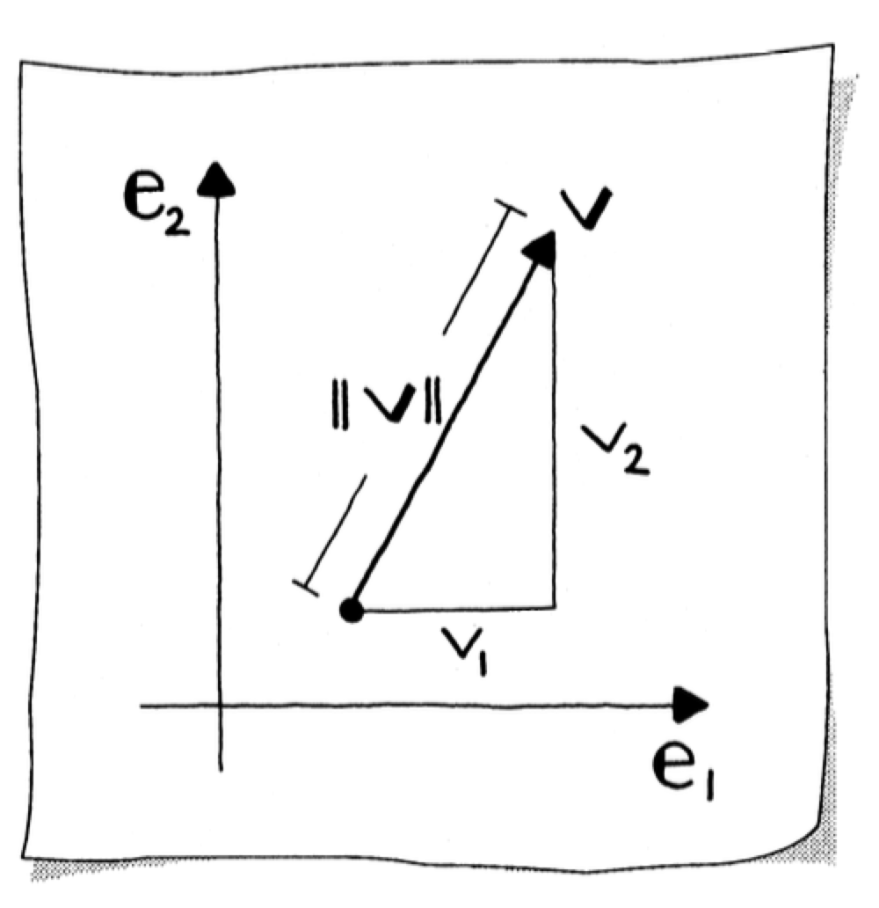
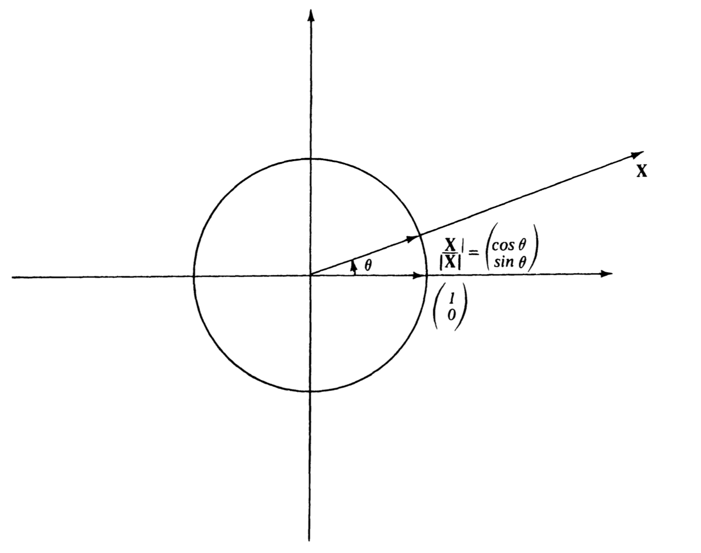
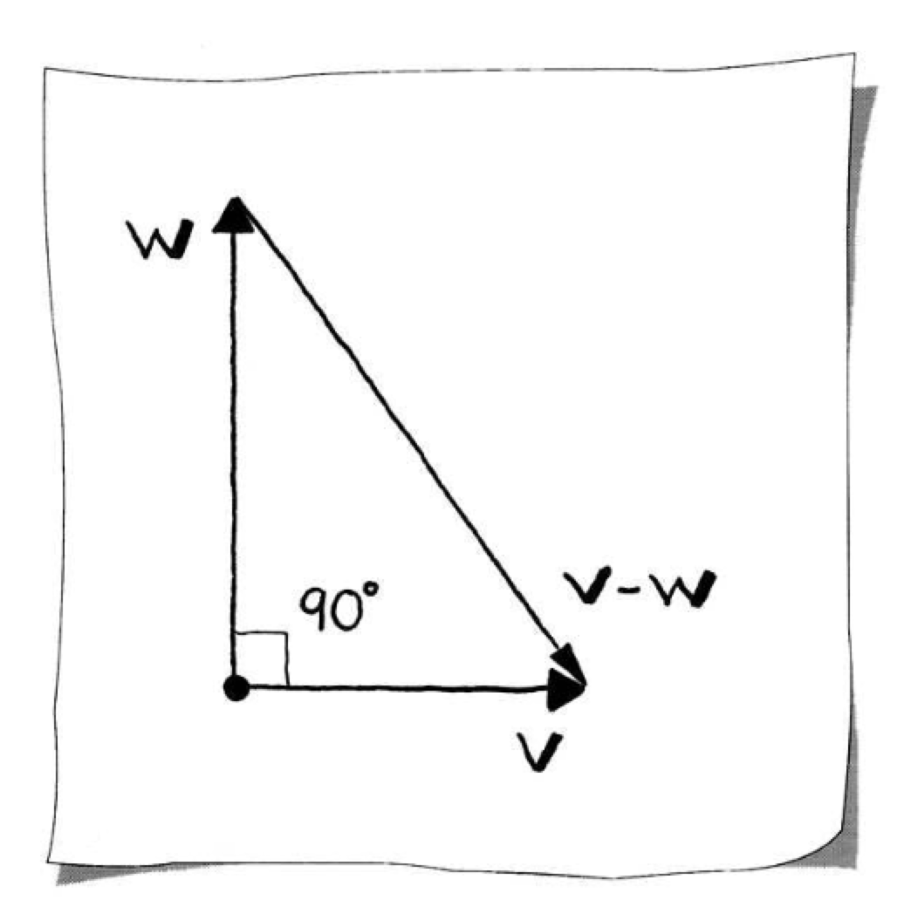
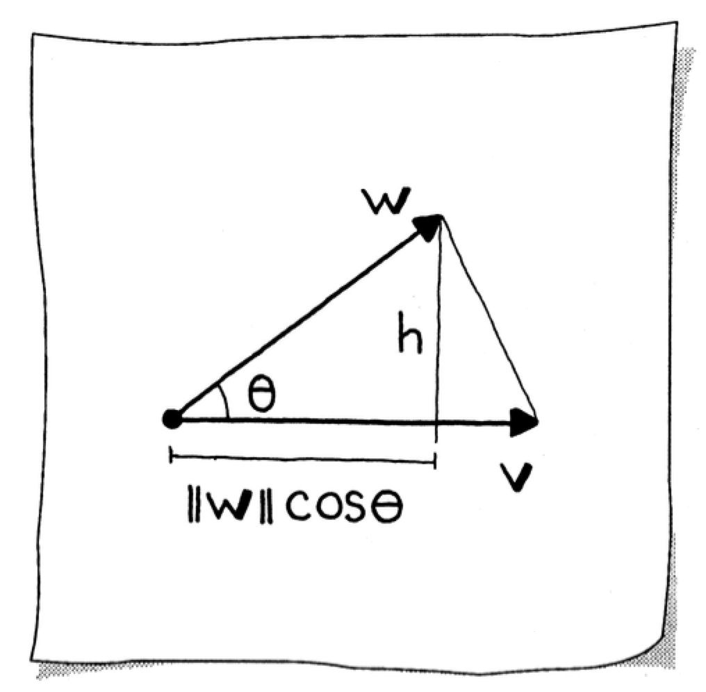
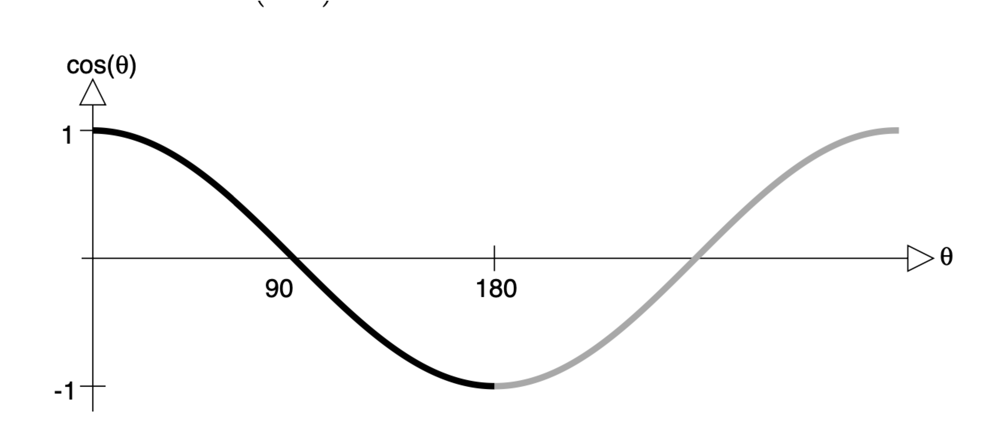
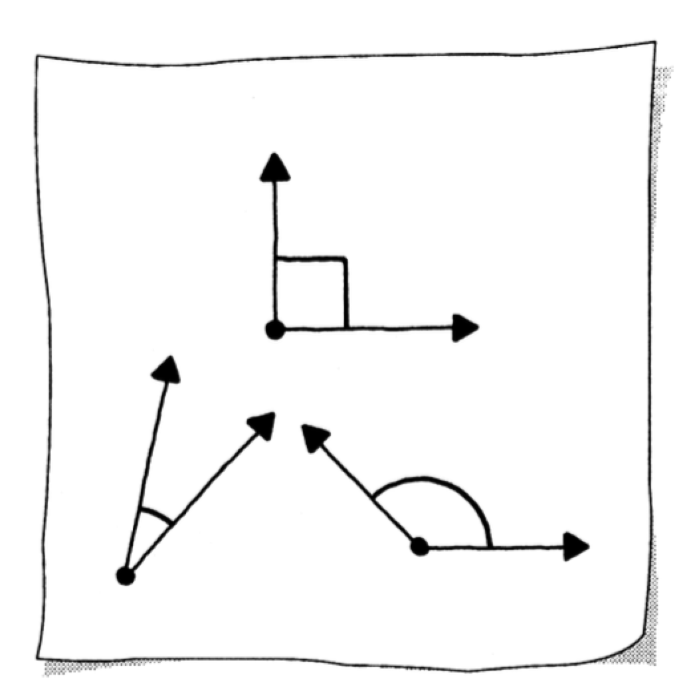
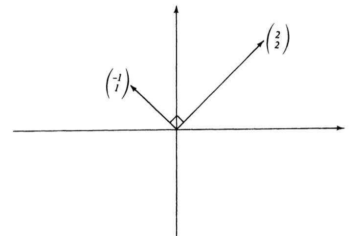

# Dot Product and Orthogonality

The [dot product](https://mathworld.wolfram.com/DotProduct.html) is a fundamental operation in linear algebra that connects algebraic computations with geometric concepts like angles and perpendicularity. This document builds from vector length through to orthogonality, establishing the mathematical foundations needed for projections and transformations.

## Vector Length (Magnitude)

The [length](https://mathworld.wolfram.com/VectorNorm.html) of a vector, also called its _magnitude_ or _Euclidean norm_, represents quantities such as distance, velocity, or acceleration. A vector defines the displacement necessary (with respect to the $\mathbf{e}_1$- and $\mathbf{e}_2$-axes) to get from a point at the tail to a point at the head.

### Definition via the Pythagorean Theorem

The vector and its components form a right triangle. By the [Pythagorean theorem](https://mathworld.wolfram.com/PythagoreanTheorem.html), the square of the length of the hypotenuse gives us:

$$\lVert\mathbf{v}\rVert^2 = v_1^2 + v_2^2$$

Therefore, the magnitude of $\mathbf{v}$ is:

$$\lVert\mathbf{v}\rVert = \sqrt{v_1^2 + v_2^2}$$



This is also called the _Euclidean norm_. For a point $\mathbf{X} = \lbrack x, y \rbrack^T$, the distance from the origin $\lbrack 0, 0 \rbrack^T$ is $\sqrt{x^2 + y^2}$, and we define this to be the length of the vector, written $\lvert\mathbf{X}\rvert$ or $\lVert\mathbf{X}\rVert$.

**Examples:**

- If $\mathbf{X} = \lbrack 3, 4 \rbrack^T$, then $\lvert\mathbf{X}\rvert = \sqrt{3^2 + 4^2} = 5$
- The standard basis vector $\mathbf{e}_1 = \lbrack 1, 0 \rbrack^T$ has $\lvert\mathbf{e}_1\rvert = 1$
- The zero vector has $\lvert\mathbf{0}\rvert = \sqrt{0^2 + 0^2} = 0$

### Vector Length is Always Non-Negative

Since the square root is always considered positive or zero, the length of a vector is never negative. In fact, $\lvert\mathbf{X}\rvert$ is strictly positive unless $\mathbf{X} = \mathbf{0}$.

### Scalar Multiplication and Length

For any scalar $r$:

$$\lvert r\mathbf{X}\rvert = \left\lvert \begin{bmatrix} rx \\ ry \end{bmatrix} \right\rvert = \sqrt{(rx)^2 + (ry)^2} = \sqrt{r^2 x^2 + r^2 y^2} = \lvert r\rvert \sqrt{x^2 + y^2} = \lvert r\rvert\lvert\mathbf{X}\rvert$$

Thus, the length of a _scalar multiple_ of a vector equals the length of the vector multiplied by the absolute value of the scalar. For example, $\lvert -5\mathbf{X}\rvert = \lvert -5\rvert\lvert\mathbf{X}\rvert = 5\lvert\mathbf{X}\rvert$.

```julia
julia> v = [2, 2]
2-element Vector{Int64}:
 2
 2

julia> sqrt(v[1]^2 + v[2]^2)
2.8284271247461903

julia> norm(v)
2.8284271247461903

julia> norm(v) == sqrt(v[1]^2 + v[2]^2)
true
```

## Unit Vectors

A [unit vector](https://mathworld.wolfram.com/UnitVector.html) (or _normalized vector_) $\mathbf{w}$ has length equal to one:

$$\lVert\mathbf{w}\rVert = 1$$

### Normalizing a Vector

If $\mathbf{X} \neq \mathbf{0}$, we may scale by the reciprocal $1/\lvert\mathbf{X}\rvert$ to get a unit vector:

$$\mathbf{w} = \frac{\mathbf{v}}{\lVert\mathbf{v}\rVert}$$

This vector lies along the ray from $\mathbf{0}$ to $\mathbf{X}$ and has length 1 since:

$$\left\lvert \frac{1}{\lvert\mathbf{X}\rvert} \mathbf{X} \right\rvert = \left\lvert \frac{1}{\lvert\mathbf{X}\rvert} \right\rvert \lvert\mathbf{X}\rvert = \frac{1}{\lvert\mathbf{X}\rvert} \lvert\mathbf{X}\rvert = 1$$

Each component of $\mathbf{v}$ is divided by the scalar value $\lVert\mathbf{v}\rVert$. This scalar is always non-negative, meaning zero or greater. You must check the value before dividing to ensure it exceeds your _zero divide tolerance_—the absolute value of the smallest number by which you can divide confidently.

The vectors of length 1 are represented by points on the [unit circle](https://mathworld.wolfram.com/UnitCircle.html) in the coordinate plane. There are infinitely many unit vectors; drawing them all emanating from the origin produces a circle of radius one.

```julia
julia> w = v / norm(v)
2-element Vector{Float64}:
 0.7071067811865475
 0.7071067811865475

julia> norm(w)
0.9999999999999999

julia> round(norm(w))
1.0
```

## Polar Form of a Vector

Any vector on the unit circle may be described by its angle $\theta$ from the positive $x$-axis. We call $\theta$ the [polar angle](https://mathworld.wolfram.com/PolarAngle.html) of the vector. The unit vector can be written using trigonometric functions as:

$$\begin{bmatrix} \cos\theta \\ \sin\theta \end{bmatrix}$$

If $\mathbf{X}$ is any non-zero vector, we have:

$$\mathbf{X} = \lvert\mathbf{X}\rvert \left(\frac{1}{\lvert\mathbf{X}\rvert} \mathbf{X}\right) = \lvert\mathbf{X}\rvert \begin{bmatrix} \cos\theta \\ \sin\theta \end{bmatrix} = \begin{bmatrix} \lvert\mathbf{X}\rvert \cos\theta \\ \lvert\mathbf{X}\rvert \sin\theta \end{bmatrix}$$

This representation as a positive scalar multiple of a unit vector is called the _polar form_ of the vector, since we have written the coordinates in the form of [polar coordinates](https://mathworld.wolfram.com/PolarCoordinates.html).



**Examples:**
- If $\mathbf{X} = \lbrack 3, 0 \rbrack^T$, we have $\mathbf{X} = 3\mathbf{e}_1$, where $\mathbf{e}_1 = \lbrack \cos(0), \sin(0) \rbrack^T$
- If $\mathbf{X} = \lbrack 1, 1 \rbrack^T$, then $\mathbf{X} = \sqrt{2}\lbrack 1/\sqrt{2}, 1/\sqrt{2} \rbrack^T = \sqrt{2}\lbrack \cos\theta, \sin\theta \rbrack^T$, where $\theta = 45^\circ = \pi/4$

```julia
function polar_unit(y::Vector)
    [(y[1]/norm(y)), (y[2]/norm(y))]
end

julia> y = [1, 1]
julia> z = polar_unit(y)
2-element Vector{Float64}:
 0.7071067811865475
 0.7071067811865475

julia> norm(y) * z
2-element Vector{Float64}:
 1.0
 1.0

julia> round(acosd(z[1]))
45.0
```

## Dot Product (Algebraic Definition)

Given two vectors $\mathbf{v}$ and $\mathbf{w}$, we might ask:
- Are they the _same_ vector?
- Are they perpendicular to each other?
- What _angle_ do they form?

The [dot product](https://mathworld.wolfram.com/DotProduct.html) is the tool to resolve these questions.

### Motivation from the Pythagorean Theorem

Consider two perpendicular vectors $\mathbf{v}$ and $\mathbf{w}$. By the Pythagorean theorem:

$$\lVert\mathbf{v} - \mathbf{w}\rVert^2 = \lVert\mathbf{v}\rVert^2 + \lVert\mathbf{w}\rVert^2$$



Writing the components explicitly:

$$(v_1 - w_1)^2 + (v_2 - w_2)^2 = (v_1^2 + v_2^2) + (w_1^2 + w_2^2)$$

Expanding and simplifying:

$$(v_1^2 - 2v_1w_1 + w_1^2) + (v_2^2 - 2v_2w_2 + w_2^2) - (v_1^2 + v_2^2) - (w_1^2 + w_2^2) = 0$$

This reduces to:

$$v_1w_1 + v_2w_2 = 0$$

We find that perpendicular vectors have the property that the sum of the products of their components is zero.

### Definition

For two arbitrary vectors $\mathbf{v}$ and $\mathbf{w}$, we define the _dot product_ as:

$$s = \mathbf{v} \cdot \mathbf{w} = v_1w_1 + v_2w_2$$

The dot product returns a scalar $s$, which is why it is also called a _scalar product_. Mathematicians also call it an [inner product](https://mathworld.wolfram.com/InnerProduct.html).

### Constructing Perpendicular Vectors

A vector $\mathbf{w}$ perpendicular to a given vector $\mathbf{v}$ can be formed by switching components and negating one:

$$\mathbf{w} = \begin{bmatrix} -v_2 \\ v_1 \end{bmatrix}$$

Then $\mathbf{v} \cdot \mathbf{w} = v_1(-v_2) + v_2v_1 = 0$.

### Dot Product and Vector Length

The dot product of a vector with itself gives the square of its length:

$$\mathbf{X} \cdot \mathbf{X} = \begin{bmatrix} x \\ y \end{bmatrix} \cdot \begin{bmatrix} x \\ y \end{bmatrix} = x^2 + y^2 = \lvert\mathbf{X}\rvert^2$$

Therefore, the length of any vector is the square root of the dot product with itself:

$$\lVert\mathbf{X}\rVert = \sqrt{\mathbf{X} \cdot \mathbf{X}}$$

We have $\mathbf{X} \cdot \mathbf{X} \geq 0$ for all $\mathbf{X}$, with equality if and only if $\mathbf{X} = \mathbf{0}$.

## Dot Product Properties

The dot product has the following algebraic properties for vectors $\mathbf{u}, \mathbf{v}, \mathbf{w} \in \mathbb{R}^2$:

| Property | Formula |
|----------|---------|
| Symmetric (Commutative) | $\mathbf{u} \cdot \mathbf{v} = \mathbf{v} \cdot \mathbf{u}$ |
| Homogeneous | $\mathbf{v} \cdot (s\mathbf{w}) = s(\mathbf{v} \cdot \mathbf{w})$ |
| Distributive | $(\mathbf{v} + \mathbf{w}) \cdot \mathbf{u} = \mathbf{v} \cdot \mathbf{u} + \mathbf{w} \cdot \mathbf{u}$ |
| Positive Definite | $\mathbf{v} \cdot \mathbf{v} > 0$ if $\mathbf{v} \neq \mathbf{0}$, and $\mathbf{v} \cdot \mathbf{v} = 0$ if $\mathbf{v} = \mathbf{0}$ |

## Geometric Interpretation and the Law of Cosines

The dot product has a powerful geometric interpretation connecting it to the angle between vectors.

### Derivation via the Law of Cosines

From trigonometry, the height $h$ of a triangle can be expressed as:

$$h = \lVert\mathbf{w}\rVert \sin(\theta)$$

Squaring and using the identity $\sin^2(\theta) + \cos^2(\theta) = 1$:

$$h^2 = \lVert\mathbf{w}\rVert^2 (1 - \cos^2(\theta))$$



We can also express $h^2$ using the other right triangle and the Pythagorean theorem:

$$h^2 = \lVert\mathbf{v} - \mathbf{w}\rVert^2 - (\lVert\mathbf{v}\rVert - \lVert\mathbf{w}\rVert\cos\theta)^2$$

Equating and simplifying yields the [Law of Cosines](https://mathworld.wolfram.com/LawofCosines.html):

$$\lVert\mathbf{v} - \mathbf{w}\rVert^2 = \lVert\mathbf{v}\rVert^2 + \lVert\mathbf{w}\rVert^2 - 2\lVert\mathbf{v}\rVert\lVert\mathbf{w}\rVert\cos\theta$$

This generalizes the Pythagorean theorem for triangles with an opposing angle different from $90^\circ$.

### Connecting to the Dot Product

We can also write $\lVert\mathbf{v} - \mathbf{w}\rVert^2$ using the dot product:

$$\begin{aligned}
\lVert\mathbf{v} - \mathbf{w}\rVert^2 &= (\mathbf{v} - \mathbf{w}) \cdot (\mathbf{v} - \mathbf{w}) \\
&= \lVert\mathbf{v}\rVert^2 - 2\mathbf{v} \cdot \mathbf{w} + \lVert\mathbf{w}\rVert^2
\end{aligned}$$

Equating the two expressions, we find the **geometric formula for the dot product**:

$$\mathbf{v} \cdot \mathbf{w} = \lVert\mathbf{v}\rVert\lVert\mathbf{w}\rVert\cos\theta$$

## Dot Product and Cosines

Rearranging the geometric formula, the cosine of the angle between two vectors is:

$$\cos\theta = \frac{\mathbf{v} \cdot \mathbf{w}}{\lVert\mathbf{v}\rVert\lVert\mathbf{w}\rVert}$$



### Special Cases

**Perpendicular vectors:** The dot product is zero, giving $\cos(90^\circ) = 0$.

**Parallel vectors:** If $\mathbf{v} = k\mathbf{w}$ (same or opposite direction):

$$\cos\theta = \frac{k\mathbf{w} \cdot \mathbf{w}}{\lvert k\rvert\lVert\mathbf{w}\rVert\lVert\mathbf{w}\rVert} = \frac{k\lVert\mathbf{w}\rVert^2}{\lvert k\rvert\lVert\mathbf{w}\rVert^2} = \pm 1$$

This corresponds to $\theta = 0^\circ$ (same direction) or $\theta = 180^\circ$ (opposite direction).

### Angle Classification

The cosine values range between $\pm 1$, corresponding to angles between $0^\circ$ and $180^\circ$. Three types of angles can be formed:

| Angle Type | Condition | Dot Product |
|------------|-----------|-------------|
| Right | $\cos(\theta) = 0$ | $\mathbf{v} \cdot \mathbf{w} = 0$ |
| Acute | $\cos(\theta) > 0$ | $\mathbf{v} \cdot \mathbf{w} > 0$ |
| Obtuse | $\cos(\theta) < 0$ | $\mathbf{v} \cdot \mathbf{w} < 0$ |



### Computing the Angle

To calculate the actual angle $\theta$, use the [arccosine](https://mathworld.wolfram.com/InverseCosine.html) function:

$$s = \frac{\mathbf{v} \cdot \mathbf{w}}{\lVert\mathbf{v}\rVert\lVert\mathbf{w}\rVert}, \quad \theta = \arccos(s)$$

```julia
function vector_angle_cos(p::Point, q::Point)
    s = dot(p, q) / (norm(p) * norm(q))
end

julia> v = Point(2, 1)
julia> w = Point(-1, 0)
julia> s = vector_angle_cos(v, w)
-0.8944271909999159

julia> acos(s)
2.677945044588987

julia> acosd(s)  # In degrees
153.434948822922
```

**Caution:** In some math libraries, if $s > 1$ or $s < -1$, an error occurs returning `NaN`. Due to floating-point roundoff, an intended value of $s = 1.0$ might become $s = 1.0000001$. Always check that $s$ is within $\lbrack -1, 1 \rbrack$ before computing arccosine. In many applications (such as comparing angles), the cosine itself suffices without computing the actual angle.

## Orthogonal Vectors

Two vectors are [orthogonal](https://mathworld.wolfram.com/OrthogonalVectors.html) (perpendicular) if and only if their dot product is zero:

$$\mathbf{X} \cdot \mathbf{U} = 0 \iff \mathbf{X} \perp \mathbf{U}$$

### Geometric Proof

When do we have $\mathbf{X} \cdot \mathbf{U} = xu + yv = 0$ for nonzero vectors?

One possibility is that one vector lies along the $x$-axis and the other along the $y$-axis—clearly perpendicular.

If $\mathbf{X}$ does not lie on either axis, then $x \neq 0$ and $y \neq 0$. The slope of the line from the origin through $\lbrack x, y \rbrack^T$ is $y/x$. Since $xu + yv = 0$, we have $yv = -xu$. If $u \neq 0$, then:

$$-1 = \frac{yv}{ux} = \frac{y}{x} \cdot \frac{v}{u}$$

Thus, the slope $v/u$ of the line to $\mathbf{U}$ is the negative reciprocal of $y/x$, meaning the lines are perpendicular. This relationship between [perpendicular lines](https://mathworld.wolfram.com/PerpendicularLines.html) and negative reciprocal slopes connects to the discussion of line equations in [02 Lines](02 Lines.md).



```julia
function is_orthogonal(p::Point, q::Point)
    dot(p, q) == 0
end

julia> u = Point(-1, 1)
julia> x = Point(2, 2)
julia> is_orthogonal(x, u)
true
```

### Orthogonality and Line Equations

For any vector $\lbrack x, y \rbrack^T$, the vector $\lbrack -y, x \rbrack^T$ is perpendicular to it. This leads to an important connection with line equations (see [02 Lines](02 Lines.md) for the implicit form of a line).

The line with equation:

$$ax + by = 0$$

can be described in two equivalent ways:

1. **As a set of perpendicular vectors:** The set of all vectors $\mathbf{X} = \lbrack x, y \rbrack^T$ perpendicular to the normal vector $\mathbf{n} = \lbrack a, b \rbrack^T$

2. **As a direction vector:** The line along the vector $\lbrack -b, a \rbrack^T$ (since this vector is perpendicular to $\lbrack a, b \rbrack^T$)

This connects the algebraic concept of orthogonality to the geometric representation of lines through the origin, which is foundational for understanding projections and transformations covered in later sections.

## Summary

| Concept | Formula |
|---------|---------|
| Vector length | $\lVert\mathbf{v}\rVert = \sqrt{v_1^2 + v_2^2}$ |
| Unit vector | $\hat{\mathbf{v}} = \mathbf{v}/\lVert\mathbf{v}\rVert$ |
| Polar form | $\mathbf{X} = \lvert\mathbf{X}\rvert\lbrack\cos\theta, \sin\theta\rbrack^T$ |
| Dot product (algebraic) | $\mathbf{v} \cdot \mathbf{w} = v_1w_1 + v_2w_2$ |
| Dot product (geometric) | $\mathbf{v} \cdot \mathbf{w} = \lVert\mathbf{v}\rVert\lVert\mathbf{w}\rVert\cos\theta$ |
| Angle between vectors | $\cos\theta = \frac{\mathbf{v} \cdot \mathbf{w}}{\lVert\mathbf{v}\rVert\lVert\mathbf{w}\rVert}$ |
| Orthogonality condition | $\mathbf{v} \perp \mathbf{w} \iff \mathbf{v} \cdot \mathbf{w} = 0$ |
| Perpendicular vector | $\mathbf{w} = \lbrack -v_2, v_1 \rbrack^T$ is perpendicular to $\mathbf{v} = \lbrack v_1, v_2 \rbrack^T$ |
