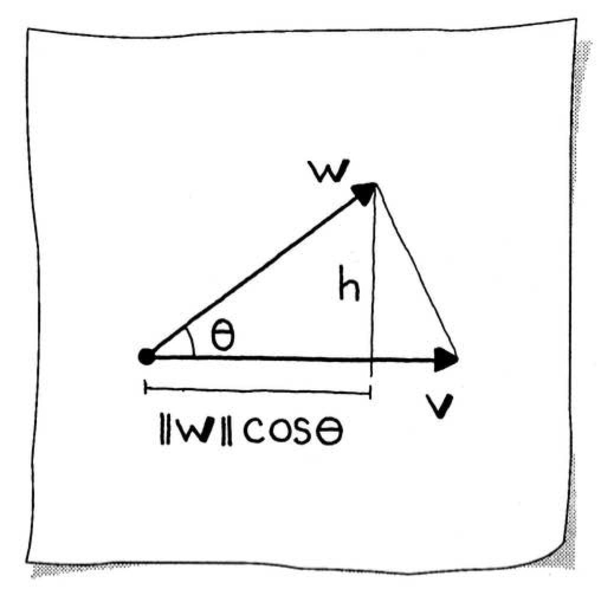
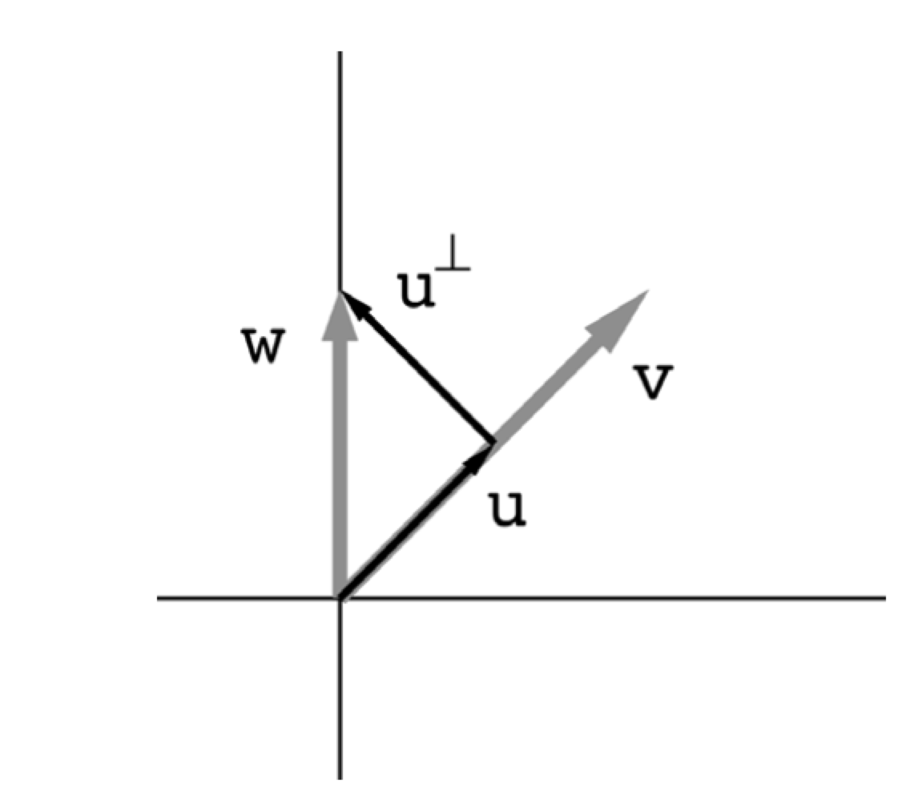
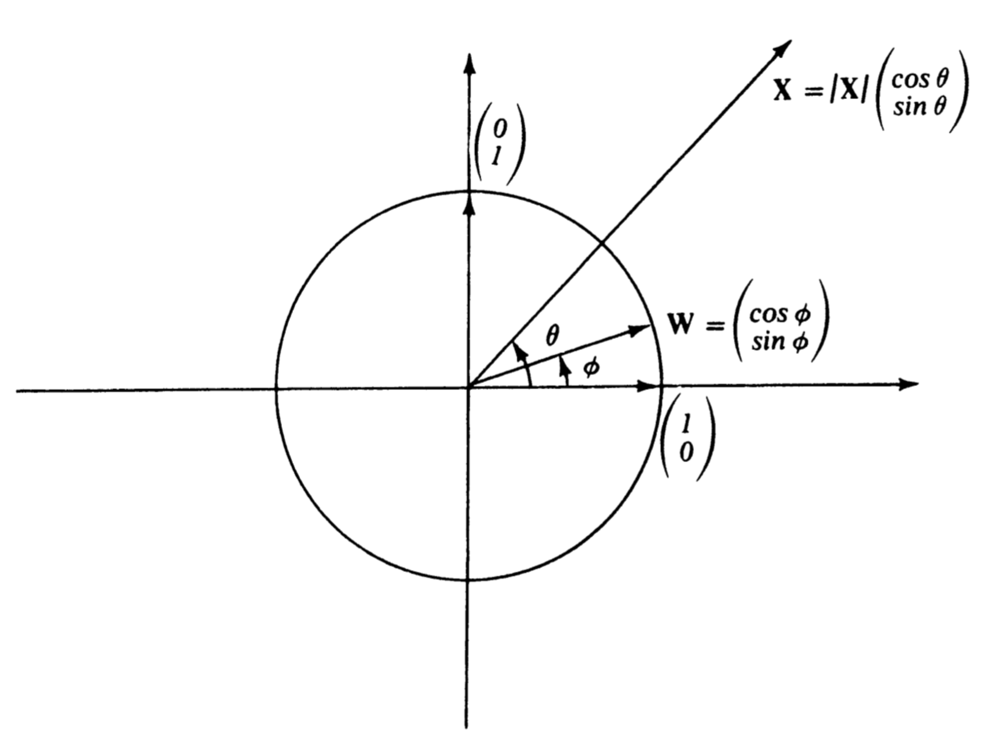
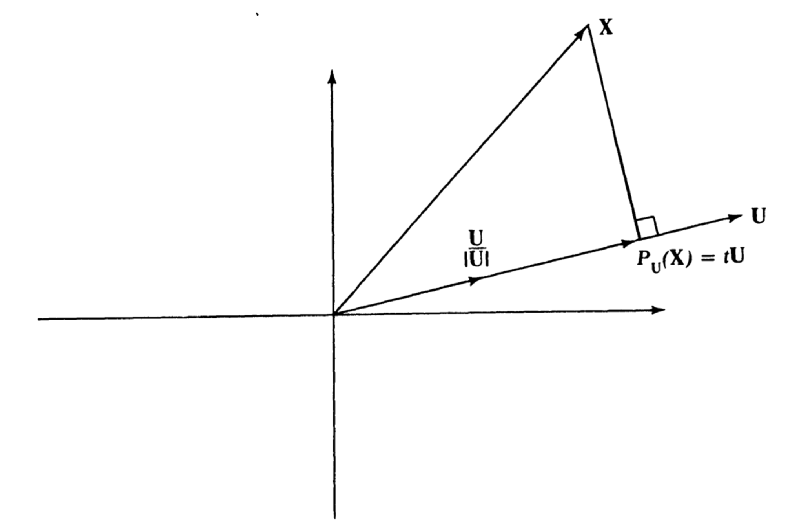
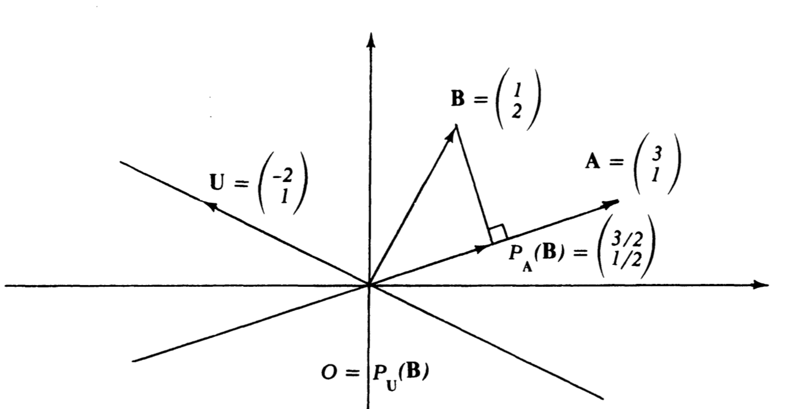
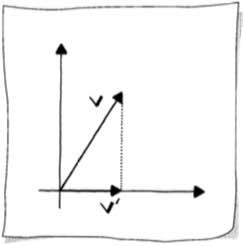
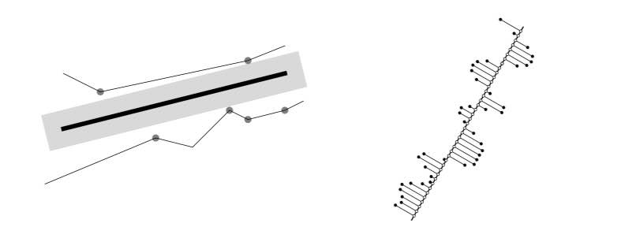
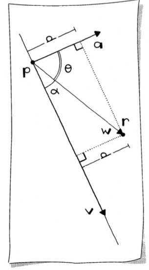
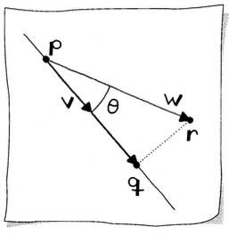
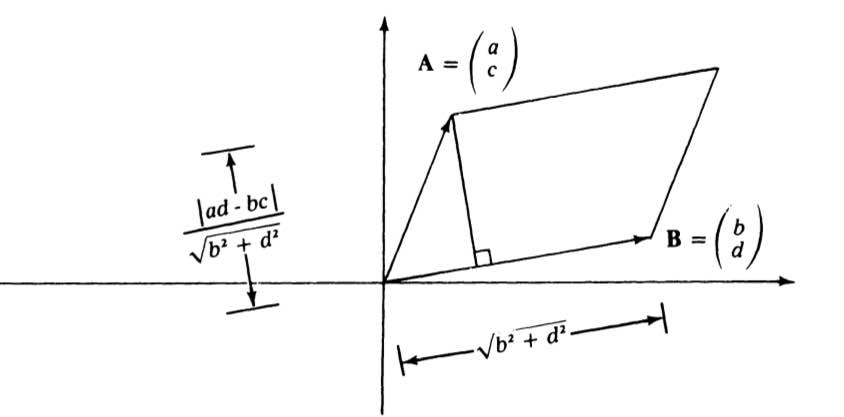

# Projections and Distance

[Projection](https://mathworld.wolfram.com/Projection.html) is a fundamental operation in linear algebra that maps vectors onto subspaces. This document covers orthogonal projection, vector decomposition, and distance calculations—essential tools for understanding geometric relationships between points, vectors, and lines.

## Orthogonal Projection Concept

[Orthogonal projection](https://mathworld.wolfram.com/OrthogonalProjection.html) acts like sunlight casting shadows at a right angle. When we project a vector $\mathbf{w}$ onto another vector $\mathbf{v}$, we find the component of $\mathbf{w}$ that lies in the direction of $\mathbf{v}$.

### Geometric Interpretation

The projection of $\mathbf{w}$ onto $\mathbf{v}$ creates a "footprint" of length $b = \lVert\mathbf{w}\rVert \cos(\theta)$, derived from basic trigonometry where $\cos(\theta) = b / \text{hypotenuse}$. The orthogonal projection vector $\mathbf{u}$ is this length multiplied by the unit vector in the direction of $\mathbf{v}$:

$$\mathbf{u} = \left(\lVert\mathbf{w}\rVert \cos(\theta)\right) \frac{\mathbf{v}}{\lVert\mathbf{v}\rVert} = \frac{\mathbf{v} \cdot \mathbf{w}}{\lVert\mathbf{v}\rVert^2} \mathbf{v}$$

This result follows from the relationship between the [dot product and cosine](03 Vectors and Geometry.md#Geometric-Interpretation-and-the-Law-of-Cosines) established earlier.



### Projection Notation

Sometimes this projection is expressed as:

$$\mathbf{u} = \operatorname{proj}_{\mathcal{V}_1} \mathbf{w}$$

where $\mathcal{V}_1$ is the set of all 2D vectors $k\mathbf{v}$, referred to as a one-dimensional _subspace_ of $\mathbb{R}^2$. The projection $\mathbf{u}$ is the _best approximation_ to $\mathbf{w}$ in the subspace $\mathcal{V}_1$.



### Dot Product and Projection

For any vector $\mathbf{X} = \lbrack x, y \rbrack^T$, the dot product with the unit vector $\mathbf{E}_1 = \lbrack 1, 0 \rbrack^T$ gives:

$$\mathbf{X} \cdot \mathbf{E}_1 = x$$

Thus, the dot product of $\mathbf{X}$ with a unit vector is the coordinate of the _projection of $\mathbf{X}$ to that axis_.

More generally, for any unit vector $\mathbf{W} = \lbrack \cos\phi, \sin\phi \rbrack^T$ and a vector $\mathbf{X} = \lvert\mathbf{X}\rvert \lbrack \cos\theta, \sin\theta \rbrack^T$ in [polar form](01 Points and Coordinates.md), we have:

$$\mathbf{X} \cdot \mathbf{W} = \lvert\mathbf{X}\rvert \cos(\theta - \phi)$$

Therefore, the dot product of a vector $\mathbf{X}$ with a unit vector $\mathbf{W}$ equals the product of the length of $\mathbf{X}$ and the cosine of the angle between them.



## Projection Formula

### Projection onto a Unit Vector

If $\mathbf{W}$ is a unit vector, then the projection of $\mathbf{X}$ onto the line through the origin in direction $\mathbf{W}$ is:

$$P_{\mathbf{W}}(\mathbf{X}) = (\mathbf{X} \cdot \mathbf{W})\mathbf{W}$$

### Projection onto an Arbitrary Vector

For an arbitrary nonzero vector $\mathbf{U}$, we first normalize it, then project:

$$P_{\mathbf{U}}(\mathbf{X}) = \left(\mathbf{X} \cdot \frac{\mathbf{U}}{\lvert\mathbf{U}\rvert}\right) \frac{\mathbf{U}}{\lvert\mathbf{U}\rvert} = \frac{(\mathbf{X} \cdot \mathbf{U})\mathbf{U}}{\lvert\mathbf{U}\rvert^2} = \frac{(\mathbf{X} \cdot \mathbf{U})\mathbf{U}}{(\mathbf{U} \cdot \mathbf{U})}$$



The equivalence of $\lVert\mathbf{v}\rVert^2$ and $\mathbf{v} \cdot \mathbf{v}$ can be verified:

```julia
julia> using LinearAlgebra

julia> v = [2, 2]
2-element Vector{Int64}:
 2
 2

julia> Int(round(norm(v)^2)) == dot(v, v)
true
```

### Length of the Projection

The length of the projection of $\mathbf{X}$ onto the line along $\mathbf{U}$ is:

$$\left\lvert\mathbf{X} \cdot \frac{\mathbf{U}}{\lvert\mathbf{U}\rvert}\right\rvert = \frac{\lvert\mathbf{X} \cdot \mathbf{U}\rvert}{\lvert\mathbf{U}\rvert}$$

```julia
julia> w = [0, 2]
2-element Vector{Int64}:
 0
 2

julia> v = [2, 2]
2-element Vector{Int64}:
 2
 2

julia> u = orthproj(v, w)  # projection of w onto v
2-element Vector{Int64}:
 1
 1

# Verify: length of projection equals formula
julia> isapprox(norm(u), abs(dot(w, v)) / norm(v), rtol=1e-15)
true
```

### Alternative Derivation

We can find the projection by seeking a scalar $t$ such that $\mathbf{X} - t\mathbf{U}$ is orthogonal to $\mathbf{U}$:

$$0 = (\mathbf{X} - t\mathbf{U}) \cdot \mathbf{U} = (\mathbf{X} \cdot \mathbf{U}) - t(\mathbf{U} \cdot \mathbf{U})$$

Solving for $t$:

$$t = \frac{\mathbf{X} \cdot \mathbf{U}}{\mathbf{U} \cdot \mathbf{U}}$$

Therefore:

$$P_{\mathbf{U}}(\mathbf{X}) = t\mathbf{U} = \left(\frac{\mathbf{X} \cdot \mathbf{U}}{\mathbf{U} \cdot \mathbf{U}}\right)\mathbf{U}$$

### Worked Example

To find the projection of $\mathbf{B} = \lbrack 1, 2 \rbrack^T$ onto the line along $\mathbf{A} = \lbrack 3, 1 \rbrack^T$:

$$P_{\mathbf{A}}(\mathbf{B}) = \left(\frac{\mathbf{A} \cdot \mathbf{B}}{\mathbf{A} \cdot \mathbf{A}}\right)\mathbf{A} = \frac{5}{10}\mathbf{A} = \frac{1}{2}\mathbf{A} = \begin{bmatrix} \frac{3}{2} \\ \frac{1}{2} \end{bmatrix}$$



When projecting $\mathbf{B} = \lbrack 1, 2 \rbrack^T$ onto $\mathbf{U} = \lbrack -2, 1 \rbrack^T$:

$$P_{\mathbf{U}}(\mathbf{B}) = \left(\frac{\mathbf{B} \cdot \mathbf{U}}{\mathbf{U} \cdot \mathbf{U}}\right)\mathbf{U} = \frac{0}{5}\mathbf{U} = \mathbf{0}$$

This confirms our intuition: if $\mathbf{X}$ is orthogonal to $\mathbf{U}$, the projection is the zero vector (the origin).

## Orthogonal Decomposition

Using orthogonal projection, any 2D vector $\mathbf{w}$ can be decomposed into a sum of two [perpendicular](https://mathworld.wolfram.com/Perpendicular.html) vectors:

$$\mathbf{w} = \mathbf{u} + \mathbf{u}^{\perp}$$

where $\mathbf{u}$ is the projection onto $\mathbf{v}$ and $\mathbf{u}^{\perp}$ is the component orthogonal to $\mathbf{v}$.

### Computing the Orthogonal Component

Having found $\mathbf{u}$, the orthogonal component is:

$$\mathbf{u}^{\perp} = \mathbf{w} - \frac{\mathbf{v} \cdot \mathbf{w}}{\lVert\mathbf{v}\rVert^2}\mathbf{v} = \mathbf{w} - \operatorname{proj}_{\mathcal{V}_1}\mathbf{w}$$

Thus $\mathbf{u}^{\perp}$ is formed by subtracting from $\mathbf{w}$ its component in the direction of $\mathbf{u}$.

### Julia Implementation

```julia
using LinearAlgebra

function orthproj(v::Vector, w::Vector)
    u = (dot(v, w) / norm(v)^2) * v
    [round(Int, x) for x in u]
end
```

**Example:**

```julia
julia> v = [2, 2]
2-element Vector{Int64}:
 2
 2

julia> w = [0, 2]
2-element Vector{Int64}:
 0
 2

julia> u = orthproj(v, w)
2-element Vector{Int64}:
 1
 1

julia> ut = w - u       # component of w orthogonal to u
2-element Vector{Int64}:
 -1
  1

julia> u + ut           # verify decomposition: reconstructs w
2-element Vector{Int64}:
 0
 2
```

## Projection Matrix

To construct a 2D orthogonal [projection matrix](https://mathworld.wolfram.com/ProjectionMatrix.html), choose a unit vector $\mathbf{u}$ defining the line onto which to project. The matrix columns are the projections of the standard basis vectors $\mathbf{e}_1$ and $\mathbf{e}_2$ onto $\mathbf{u}$:

$$\begin{aligned}
\mathbf{a}_1 &= \frac{\mathbf{u} \cdot \mathbf{e}_1}{\lVert\mathbf{u}\rVert^2}\mathbf{u} = u_1\mathbf{u} \\
\mathbf{a}_2 &= \frac{\mathbf{u} \cdot \mathbf{e}_2}{\lVert\mathbf{u}\rVert^2}\mathbf{u} = u_2\mathbf{u}
\end{aligned}$$

The projection matrix is:

$$A = \lbrack u_1\mathbf{u} \quad u_2\mathbf{u} \rbrack = \frac{\mathbf{u}\mathbf{u}^T}{\lVert\mathbf{u}\rVert^2}$$

This _dyadic matrix_ has rank 1, reflecting that projections reduce dimensionality.

### Properties of Projection Matrices

A projection matrix is _idempotent_: $A = AA$. Geometrically, once a vector has been projected onto a line, applying the same projection leaves the result unchanged.

```julia
function projection_matrix(u::Vector)
    u * transpose(u) ./ (transpose(u) * u)
end
```

```julia
julia> u = [1, 2]
2-element Vector{Int64}:
 1
 2

julia> A = projection_matrix(u)
2×2 Matrix{Float64}:
 0.2  0.4
 0.4  0.8

julia> v = [1, 2]
2-element Vector{Int64}:
 1
 2

julia> v′ = A * v
2-element Vector{Float64}:
 1.0
 2.0

julia> A * v′  # Idempotent: projecting again gives same result
2-element Vector{Float64}:
 1.0
 2.0
```



## Distance from a Point to a Line

If you have a point $\mathbf{r}$ and a line $\mathbf{l}$, the distance from the point to the line is the length of the perpendicular segment. This is the _shortest_ distance, as established by the orthogonal projection concept.



There are two main approaches depending on the [line representation](02 Lines.md):

### Using the Parametric Equation

**Given:** A line $\mathbf{l}$ in parametric form, defined by point $\mathbf{p}$ and direction vector $\mathbf{v}$, and a point $\mathbf{r}$.

**Find:** The distance $d(\mathbf{r}, \mathbf{l})$.

**Solution:** Form the vector $\mathbf{w} = \mathbf{r} - \mathbf{p}$ and use:

$$d = \lVert\mathbf{w}\rVert \sin(\alpha)$$

where $\sin(\alpha) = \sqrt{1 - \cos^2(\alpha)}$ and:

$$\cos(\alpha) = \frac{\mathbf{v} \cdot \mathbf{w}}{\lVert\mathbf{v}\rVert\lVert\mathbf{w}\rVert}$$



```julia
function distance_to_parametric_line(p::Point, v::Vector, r::Point)
    w = Vector(r - p)
    cosα = dot(v, w) / (norm(v) * norm(w))
    d = norm(w) * sqrt(1 - cosα^2)
end
```

```julia
julia> p = Point(0, 4)
julia> v = [2, -4]
julia> r = Point(5, 3)

julia> distance_to_parametric_line(p, v, r)
4.024922359499621
```

### Using the Implicit Equation

**Given:** A line $\mathbf{l}$ in [implicit form](02 Lines.md) $ax + by + c = 0$ and a point $\mathbf{r}$.

**Find:** The distance $d(\mathbf{r}, \mathbf{l})$.

**Solution:** With the normal vector $\mathbf{a} = \lbrack a, b \rbrack^T$:

$$d = \frac{ar_1 + br_2 + c}{\lVert\mathbf{a}\rVert}$$

Or in vector notation:

$$d = \frac{\mathbf{a} \cdot (\mathbf{r} - \mathbf{p})}{\lVert\mathbf{a}\rVert}$$

where $\mathbf{p}$ is any point on the line.


**Derivation:** The implicit equation is derived from the dot product $\mathbf{a} \cdot (\mathbf{x} - \mathbf{p}) = 0$. For a point $\mathbf{r}$ not on the line:

$$v = \mathbf{a} \cdot (\mathbf{r} - \mathbf{p}) = \mathbf{a} \cdot \mathbf{w} = \lVert\mathbf{a}\rVert\lVert\mathbf{w}\rVert\cos(\theta)$$

From the right triangle geometry, $\cos(\theta) = d / \lVert\mathbf{w}\rVert$, so:

$$v = \lVert\mathbf{a}\rVert d \implies d = \frac{v}{\lVert\mathbf{a}\rVert}$$

```julia
function distance_to_implicit_line(a::Number, b::Number, c::Number, r::Point)
    v = [a, b]
    d = ((a * r[1]) + (b * r[2]) + c) / norm(v)
end
```

```julia
julia> a, b, c = 4, 2, -8
julia> r = Point(5, 3)

julia> distance_to_implicit_line(a, b, c, r)
4.024922359499621
```

### Point Normal Form

When checking many points against a line, it's efficient to store the line in _point normal form_ where $\lVert\mathbf{a}\rVert = 1$, eliminating the division:

$$\frac{ax_1 + bx_2 + c}{\lVert\mathbf{a}\rVert} = 0$$

```julia
function implicit_line_point_normal_form(a::Number, b::Number, c::Number)
    v = [a, b]
    n = norm(v)
    (a/n, b/n, c/n)
end
```

## Foot of a Point on a Line

The _foot_ of a point $\mathbf{r}$ on a line is the point $\mathbf{q}$ on the line closest to $\mathbf{r}$—where the perpendicular from $\mathbf{r}$ meets the line.

**Given:** A line $\mathbf{l}$ in parametric form (point $\mathbf{p}$ and vector $\mathbf{v}$) and a point $\mathbf{r}$.

**Find:** The point $\mathbf{q}$ on the line closest to $\mathbf{r}$.

**Solution:** Since $\mathbf{q}$ lies on the line:

$$\mathbf{q} = \mathbf{p} + t\mathbf{v}$$

We need to find $t$. From the geometry, with $\mathbf{w} = \mathbf{r} - \mathbf{p}$:

$$\cos(\theta) = \frac{\lVert t\mathbf{v}\rVert}{\lVert\mathbf{w}\rVert}$$

Using the [dot product formula for cosine](03 Vectors and Geometry.md#Geometric-Interpretation-and-the-Law-of-Cosines):

$$\cos(\theta) = \frac{\mathbf{v} \cdot \mathbf{w}}{\lVert\mathbf{v}\rVert\lVert\mathbf{w}\rVert}$$

Solving for $t$:

$$t = \frac{\mathbf{v} \cdot \mathbf{w}}{\lVert\mathbf{v}\rVert^2}$$



```julia
function foot_of_line(p::Point, v::Vector, r::Point)
    w = Vector(r - p)
    t = dot(v, w) / norm(v)^2
    q = Point(p + t * v)
end
```

```julia
julia> p = Point(0, 1)
julia> v = [0, 2]
julia> r = Point(3, 4)

julia> foot_of_line(p, v, r)
2-element Point{2, Float64}:
 0.0
 4.0

julia> r = Point(2, -1)
julia> foot_of_line(p, v, r)
2-element Point{2, Float64}:
  0.0
 -1.0
```

### Distance from Foot to Line Point

In some applications, the signed distance from $\mathbf{q}$ to $\mathbf{p}$ is needed:

$$\lVert\mathbf{q} - \mathbf{p}\rVert = \lVert t\mathbf{v}\rVert = t\lVert\mathbf{v}\rVert = \frac{\mathbf{v} \cdot \mathbf{w}}{\lVert\mathbf{v}\rVert}$$

```julia
function foot_of_line(p::Point, v::Vector, r::Point)
    w = Vector(r - p)
    t = dot(v, w) / norm(v)^2
    q = Point(p + t * v)
    d = dot(v, w) / norm(v)
    (q, d)
end
```

```julia
julia> r = Point(3, 4)
julia> foot_of_line(p, v, r)
([0.0, 4.0], 3.0)

julia> r = Point(2, -1)
julia> foot_of_line(p, v, r)
([0.0, -1.0], -2.0)
```

## Side of a Line

The distance formula from the implicit equation provides more than just the magnitude—its _sign_ indicates which side of the line a point lies on.

Given an implicit line $ax + by + c = 0$ with normal vector $\mathbf{a} = \lbrack a, b \rbrack^T$:

$$d = \frac{ar_1 + br_2 + c}{\lVert\mathbf{a}\rVert}$$

The sign of $d$ depends on the orientation of $\mathbf{a}$:
- **Positive** $d$: The point is on the side toward which $\mathbf{a}$ points
- **Negative** $d$: The point is on the opposite side
- **Zero** $d$: The point is on the line

```julia
function point_side_of_line(p::Point, q::Point, x::Point)
    a = q[2] - p[2]
    b = p[1] - q[1]
    c = -(a * p[1]) - (b * p[2])
    (a * x[1] + b * x[2] + c) / norm([a, b])
end
```

```julia
julia> p = Point(2, 2)
julia> q = Point(6, 4)

# Point on the line
julia> x = Point(2, 2)
julia> point_side_of_line(p, q, x)
0.0

# Point on opposite side from normal direction
julia> x = Point(0, 3)
julia> point_side_of_line(p, q, x)
-1.7888543819998317

# Point on same side as normal direction
julia> x = Point(4, 1)
julia> point_side_of_line(p, q, x)
0.8944271909999159
```

This is useful for determining whether points are separated by a line, or for classifying points relative to geometric boundaries.

## Area of a Parallelogram

The [parallelogram](https://mathworld.wolfram.com/Parallelogram.html) formed by two vectors has an area that can be computed using the projection formula.

### Formula Derivation

For a parallelogram with one vertex at the origin and adjacent vertices at $\mathbf{A} = \lbrack a, c \rbrack^T$ and $\mathbf{B} = \lbrack b, d \rbrack^T$:

The height is the distance from $\mathbf{A}$ to the line along $\mathbf{B}$:

$$h = \frac{\lvert ad - bc\rvert}{\sqrt{b^2 + d^2}}$$

Multiplying by the base length $\sqrt{b^2 + d^2}$:

$$\text{Area} = \lvert ad - bc\rvert$$



This expression $\lvert ad - bc\rvert$ is the absolute value of the [determinant](https://mathworld.wolfram.com/Determinant.html) of the matrix $\lbrack\mathbf{A} \; \mathbf{B}\rbrack$.

### Using Foot of Point

A more elegant approach uses the foot-of-point calculation:

```julia
function parallelogram_area(P::Point, A::Point, B::Point)
    v = Vector(B - P)
    w = Vector(A - P)
    t = dot(v, w) / norm(v)^2
    q = Point(P + t * v)
    d = dot(v, w) / norm(v)
    area = d * norm(v)
    (q, d, area)
end
```

```julia
julia> A = Point(3, 1)
julia> B = Point(1, 3)
julia> P = Point(0, 0)

julia> parallelogram_area(P, A, B)
([0.6, 1.8], 1.897..., 6.0)

# Verify with determinant formula
julia> (A[1] * B[2]) - (B[1] * A[2])
8

julia> abs((A[1] * B[2]) - (B[1] * A[2]))
8
```

## Summary

| Concept | Formula | Key Insight |
|---------|---------|-------------|
| Orthogonal projection | $\frac{(\mathbf{v} \cdot \mathbf{w})}{\lVert\mathbf{v}\rVert^2}\mathbf{v}$ | Best approximation in subspace |
| Orthogonal decomposition | $\mathbf{w} = \mathbf{u} + \mathbf{u}^{\perp}$ | Any vector splits into parallel and perpendicular parts |
| Distance (parametric) | $\lVert\mathbf{w}\rVert\sin(\alpha)$ | Uses sine of angle |
| Distance (implicit) | $\frac{ar_1 + br_2 + c}{\lVert\mathbf{a}\rVert}$ | Sign indicates side |
| Foot of point | $\mathbf{p} + t\mathbf{v}$ where $t = \frac{\mathbf{v} \cdot \mathbf{w}}{\lVert\mathbf{v}\rVert^2}$ | Closest point on line |
| Parallelogram area | $\lvert ad - bc\rvert$ | Absolute value of determinant |
