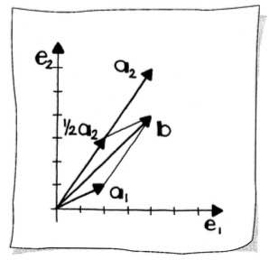
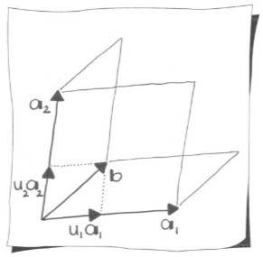
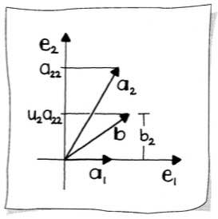
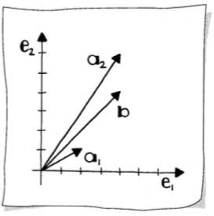
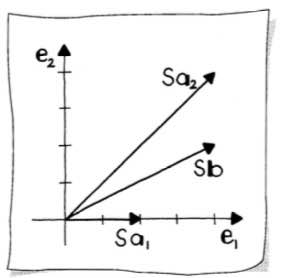
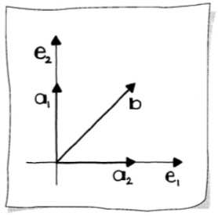

# Linear Systems

A [system of linear equations](https://mathworld.wolfram.com/SystemofEquations.html) (or _linear system_) is a collection of linear equations involving the same set of variables. Solving such systems is fundamental to linear algebra and has applications throughout mathematics, science, and engineering.

## What Are Linear Systems?

### The Geometric Motivation

In our standard $\lbrack \mathbf{e}_1, \mathbf{e}_2 \rbrack$-coordinate system, suppose we are given two vectors $\mathbf{a}_1$ and $\mathbf{a}_2$. These vectors define a _skew target box_ with its lower-left corner at the origin. Given a vector $\mathbf{b}$ with respect to the $\lbrack \mathbf{e}_1, \mathbf{e}_2 \rbrack$-system, we ask: what are the components of $\mathbf{b}$ with respect to the $\lbrack \mathbf{a}_1, \mathbf{a}_2 \rbrack$-system?



In other words, we want to find a vector $\mathbf{u}$ with components $u_1$ and $u_2$, satisfying:

$$u_1 \mathbf{a}_1 + u_2 \mathbf{a}_2 = \mathbf{b}$$

### A Concrete Example

For example, let:

$$\mathbf{a}_1 = \begin{bmatrix} 2 \\ 1 \end{bmatrix}, \quad \mathbf{a}_2 = \begin{bmatrix} 4 \\ 6 \end{bmatrix}, \quad \mathbf{b} = \begin{bmatrix} 4 \\ 4 \end{bmatrix}$$

Upon examining the geometry, we see that:

$$1 \times \begin{bmatrix} 2 \\ 1 \end{bmatrix} + \frac{1}{2} \times \begin{bmatrix} 4 \\ 6 \end{bmatrix} = \begin{bmatrix} 4 \\ 4 \end{bmatrix}$$

In the $\lbrack \mathbf{a}_1, \mathbf{a}_2 \rbrack$-system, $\mathbf{b}$ has components $(1, 1/2)$. In the $\lbrack \mathbf{e}_1, \mathbf{e}_2 \rbrack$-system, it has components $(4, 4)$.

What we have here are really two equations in the two unknowns $u_1$ and $u_2$, which we see by expanding the vector equations into:

$$\begin{aligned}
2u_1 + 4u_2 &= 4 \\
u_1 + 6u_2 &= 4
\end{aligned}$$

These two equations in two unknowns have the solution $u_1 = 1$ and $u_2 = 1/2$, as is seen by inserting these values into the equations. This pair of equations is called a _linear system_.

## Matrix Form of Linear Systems

The linear system can be written more compactly using matrix notation:

$$\begin{bmatrix} 2 & 4 \\ 1 & 6 \end{bmatrix} \begin{bmatrix} u_1 \\ u_2 \end{bmatrix} = \begin{bmatrix} 4 \\ 4 \end{bmatrix}$$

### General Form

In general, a $2 \times 2$ linear system looks like this:

$$\begin{bmatrix} a_{1,1} & a_{1,2} \\ a_{2,1} & a_{2,2} \end{bmatrix} \begin{bmatrix} u_1 \\ u_2 \end{bmatrix} = \begin{bmatrix} b_1 \\ b_2 \end{bmatrix}$$

It is shorthand notation for the equations:

$$\begin{aligned}
a_{1,1} u_1 + a_{1,2} u_2 &= b_1 \\
a_{2,1} u_1 + a_{2,2} u_2 &= b_2
\end{aligned}$$

We sometimes write it even shorter, using a matrix $A$:

$$A \mathbf{u} = \mathbf{b}$$

where:

$$A = \begin{bmatrix} a_{1,1} & a_{1,2} \\ a_{2,1} & a_{2,2} \end{bmatrix}, \quad \mathbf{u} = \begin{bmatrix} u_1 \\ u_2 \end{bmatrix}, \quad \mathbf{b} = \begin{bmatrix} b_1 \\ b_2 \end{bmatrix}$$

Both $\mathbf{u}$ and $\mathbf{b}$ represent vectors, not points. The vector $\mathbf{u}$ is called the _solution_ of the linear system.

The columns of the matrix $A$ correspond to the vectors $\mathbf{a}_1$ and $\mathbf{a}_2$. We could then rewrite our linear system as:

$$u_1 \mathbf{a}_1 + u_2 \mathbf{a}_2 = \mathbf{b}$$

Geometrically, we are trying to express the given vector $\mathbf{b}$ as a linear combination of the given vectors $\mathbf{a}_1$ and $\mathbf{a}_2$; we need to determine the factors $u_1$ and $u_2$.

### Solution Space

If we are able to find at least one solution, then the linear system is called _consistent_; otherwise it is called _inconsistent_. Three possibilities for our solution space exist:

1. There is exactly one solution vector $\mathbf{u}$. In this case, $\lvert A \rvert \neq 0$, thus the matrix has full rank and is non-singular.
2. There is no solution—the system is _inconsistent_.
3. There are infinitely many solutions.

## Cramer's Rule

[Cramer's Rule](https://mathworld.wolfram.com/CramersRule.html) provides a direct solution to a linear system using [determinants](07 Matrices and Maps.md#determinants). By inspecting the areas of parallelograms, we see that:

$$u_1 = \frac{\text{area}(\mathbf{b}, \mathbf{a}_2)}{\text{area}(\mathbf{a}_1, \mathbf{a}_2)}, \quad u_2 = \frac{\text{area}(\mathbf{a}_1, \mathbf{b})}{\text{area}(\mathbf{a}_1, \mathbf{a}_2)}$$



### Geometric Interpretation

An easy way to see how these ratios of areas correspond to $u_1$ and $u_2$ is to shear the parallelograms formed by $\mathbf{b}, \mathbf{a}_2$ and $\mathbf{b}, \mathbf{a}_1$ onto the $\mathbf{a}_1$ and $\mathbf{a}_2$ axes, respectively. Shears preserve areas.

The area $(u_1 \cdot \mathbf{a}_1) \times \mathbf{a}_2$ is the area of the sheared parallelogram defined by $\mathbf{b}$ and $\mathbf{a}_2$, and $(u_2 \cdot \mathbf{a}_2) \times \mathbf{a}_1$ is the area of the sheared parallelogram defined by $\mathbf{a}_1$ and $\mathbf{b}$.

### The Formula

The area of a parallelogram is given by the [determinant](07 Matrices and Maps.md#determinants) of the two vectors spanning it (this is a signed area). Cramer's rule states:

$$u_1 = \frac{\begin{vmatrix} b_1 & a_{1,2} \\ b_2 & a_{2,2} \end{vmatrix}}{\begin{vmatrix} a_{1,1} & a_{1,2} \\ a_{2,1} & a_{2,2} \end{vmatrix}}, \quad u_2 = \frac{\begin{vmatrix} a_{1,1} & b_1 \\ a_{2,1} & b_2 \end{vmatrix}}{\begin{vmatrix} a_{1,1} & a_{1,2} \\ a_{2,1} & a_{2,2} \end{vmatrix}}$$

Notice that $\mathbf{b}$ replaces $\mathbf{a}_1$ in the solution for $u_1$, and $\mathbf{b}$ replaces $\mathbf{a}_2$ in the solution for $u_2$.

### Worked Example

Applying Cramer's rule to our example system:

$$u_1 = \frac{\begin{vmatrix} 4 & 4 \\ 4 & 6 \end{vmatrix}}{\begin{vmatrix} 2 & 4 \\ 1 & 6 \end{vmatrix}} = \frac{24 - 16}{12 - 4} = \frac{8}{8} = 1$$

$$u_2 = \frac{\begin{vmatrix} 2 & 4 \\ 1 & 4 \end{vmatrix}}{\begin{vmatrix} 2 & 4 \\ 1 & 6 \end{vmatrix}} = \frac{8 - 4}{8} = \frac{4}{8} = \frac{1}{2}$$

### Julia Implementation

```julia
julia> a₁ = [2, 1]
2-element Vector{Int64}:
 2
 1

julia> a₂ = [4, 6]
2-element Vector{Int64}:
 4
 6

julia> b = [4, 4]
2-element Vector{Int64}:
 4
 4

julia> A = [a₁ a₂]
2×2 Matrix{Int64}:
 2  4
 1  6

julia> using LinearAlgebra

# Direct solution using backslash operator
julia> u = A \ b
2-element Vector{Float64}:
 1.0
 0.5

# Cramer's Rule solution
julia> d₁ = det([b a₂])    # determinant with b replacing a₁
8.0

julia> d₂ = det([a₁ a₂])   # determinant of A
8.0

julia> d₃ = det([a₁ b])    # determinant with b replacing a₂
4.0

julia> u₁ = d₁ / d₂
1.0

julia> u₂ = d₃ / d₂
0.5
```

### Limitations

If the area spanned by $\mathbf{a}_1$ and $\mathbf{a}_2$ is zero—that is, the vectors are multiples of each other—then Cramer's rule will not yield a solution.

Cramer's rule is primarily of theoretical importance. For larger systems, Cramer's rule is both computationally expensive and numerically unstable.

## Gaussian Elimination

[Gaussian elimination](https://mathworld.wolfram.com/GaussianElimination.html) is a systematic method for solving linear systems by transforming the coefficient matrix into upper triangular form, then solving by back substitution.

### Upper Triangular Systems

Consider a special $2 \times 2$ linear system:

$$\begin{bmatrix} a_{1,1} & a_{1,2} \\ 0 & a_{2,2} \end{bmatrix} \mathbf{u} = \mathbf{b}$$



This matrix is called _upper triangular_ because all elements below the diagonal are zero, forming a triangle of numbers above the diagonal.

We can solve this system easily. Examining the last equation, we solve for:

$$u_2 = \frac{b_2}{a_{2,2}}$$

With $u_2$ in hand, we can solve the first equation for:

$$u_1 = \frac{1}{a_{1,1}}(b_1 - u_2 a_{1,2})$$

This technique of solving equations from the bottom up is called _back substitution_.

Notice that back substitution requires divisions. If the diagonal elements $a_{1,1}$ or $a_{2,2}$ equal zero, the algorithm fails. This indicates that the columns of $A$ are not linearly independent.

### Forward Elimination

In general, we will not encounter upper triangular systems directly. But any linear system with non-singular $A$ may be transformed to this form. We write our system as:

$$u_1 \begin{bmatrix} 2 \\ 1 \end{bmatrix} + u_2 \begin{bmatrix} 4 \\ 6 \end{bmatrix} = \begin{bmatrix} 4 \\ 4 \end{bmatrix}$$



Clearly, $\mathbf{a}_1$ is not on the $\mathbf{e}_1$-axis as we would like, but we can apply a systematic procedure to make it so. This procedure is called _forward elimination_.

Recall that linear maps do not change linear combinations. If we apply the same linear map to all vectors in our system, the factors $u_1$ and $u_2$ won't change. If the map is given by a matrix $S$:

$$S\left(u_1 \begin{bmatrix} 2 \\ 1 \end{bmatrix} + u_2 \begin{bmatrix} 4 \\ 6 \end{bmatrix}\right) = S \begin{bmatrix} 4 \\ 4 \end{bmatrix}$$

### The Shear Transformation

To get $\mathbf{a}_1$ to line up with the $\mathbf{e}_1$-axis, we employ a shear parallel to the $\mathbf{e}_2$-axis:

$$\begin{bmatrix} 2 \\ 1 \end{bmatrix} \text{ is mapped to } \begin{bmatrix} 2 \\ 0 \end{bmatrix}$$

That shear is given by:

$$S_1 = \begin{bmatrix} 1 & 0 \\ -1/2 & 1 \end{bmatrix}$$

We apply $S_1$ to all vectors in our system:

$$\begin{bmatrix} 1 & 0 \\ -1/2 & 1 \end{bmatrix} \begin{bmatrix} 2 \\ 1 \end{bmatrix} = \begin{bmatrix} 2 \\ 0 \end{bmatrix}$$

$$\begin{bmatrix} 1 & 0 \\ -1/2 & 1 \end{bmatrix} \begin{bmatrix} 4 \\ 6 \end{bmatrix} = \begin{bmatrix} 4 \\ 4 \end{bmatrix}$$

$$\begin{bmatrix} 1 & 0 \\ -1/2 & 1 \end{bmatrix} \begin{bmatrix} 4 \\ 4 \end{bmatrix} = \begin{bmatrix} 4 \\ 2 \end{bmatrix}$$



Our transformed system now reads:

$$\begin{bmatrix} 2 & 4 \\ 0 & 4 \end{bmatrix} \begin{bmatrix} u_1 \\ u_2 \end{bmatrix} = \begin{bmatrix} 4 \\ 2 \end{bmatrix}$$

### Back Substitution

Now we employ back substitution:

$$u_2 = \frac{2}{4} = \frac{1}{2}$$

$$u_1 = \frac{1}{2}\left(4 - 4 \times \frac{1}{2}\right) = 1$$

The process of forward elimination followed by back substitution is called _Gauss elimination_.

### Julia Implementation

```julia
julia> a₁ = [2, 1]
2-element Vector{Int64}:
 2
 1

julia> a₂ = [4, 6]
2-element Vector{Int64}:
 4
 6

julia> b = [4, 4]
2-element Vector{Int64}:
 4
 4

# Shear matrix S₁
julia> S₁ = [1 0; -1/2 1]
2×2 Matrix{Float64}:
  1.0  0.0
 -0.5  1.0

# Forward elimination of a₁ using shear S₁
julia> a₁′ = S₁ * a₁
2-element Vector{Float64}:
 2.0
 0.0

# Forward elimination of a₂ using shear S₁
julia> a₂′ = S₁ * a₂
2-element Vector{Float64}:
 4.0
 4.0

# Forward elimination of b using shear S₁
julia> b′ = S₁ * b
2-element Vector{Float64}:
 4.0
 2.0

# Back substitution: solve for u₂
julia> u₂ = b′[2] / a₂′[2]
0.5

# Back substitution: solve for u₁
julia> u₁ = (1 / a₁′[1]) * (b′[1] - (u₂ * a₂′[1]))
1.0
```

## Elementary Matrices

An [elementary matrix](https://mathworld.wolfram.com/ElementaryRowandColumnOperations.html) is a matrix that performs a single [elementary row operation](https://mathworld.wolfram.com/ElementaryRowandColumnOperations.html) when multiplied with another matrix.

### Elementary Row Operations

The shear matrix $S_1$ from Gaussian elimination is an example of an elementary matrix. Algebraically, we achieved the transformed system by modifying the second row only:

$$\text{row}_2 = -\frac{1}{2} \text{row}_1 + \text{row}_2$$

This is called an _elementary row operation_. There are three types of elementary row operations:

1. **Row scaling**: Multiply a row by a non-zero scalar
2. **Row addition**: Add a multiple of one row to another row
3. **Row exchange**: Swap two rows (see [Pivoting](#pivoting))

Each elementary row operation corresponds to multiplication by an elementary matrix.

### The Shear as an Elementary Matrix

The shear matrix:

$$S_1 = \begin{bmatrix} 1 & 0 \\ -1/2 & 1 \end{bmatrix}$$

performs the operation $\text{row}_2 \leftarrow \text{row}_2 - \frac{1}{2}\text{row}_1$. This elementary matrix is obtained by applying the same operation to the identity matrix.

## Pivoting

Because of the central role that diagonal elements play in Gaussian elimination, they are called [pivots](https://mathworld.wolfram.com/Pivot.html).

### When Pivoting is Necessary

Consider the system:

$$\begin{bmatrix} 0 & 1 \\ 1 & 0 \end{bmatrix} \begin{bmatrix} u_1 \\ u_2 \end{bmatrix} = \begin{bmatrix} 1 \\ 1 \end{bmatrix}$$



Our standard approach—shearing $\mathbf{a}_1$ onto the $\mathbf{e}_1$-axis—will not work here; there is no shear that takes $\begin{bmatrix} 0 \\ 1 \end{bmatrix}$ onto the $\mathbf{e}_1$-axis.

However, there is no problem if we simply exchange the two equations:

$$\begin{bmatrix} 1 & 0 \\ 0 & 1 \end{bmatrix} \begin{bmatrix} u_1 \\ u_2 \end{bmatrix} = \begin{bmatrix} 1 \\ 1 \end{bmatrix}$$

Thus $u_1 = u_2 = 1$.

### The Permutation Matrix

This row exchange is a linear map represented by the _permutation matrix_:

$$P = \begin{bmatrix} 0 & 1 \\ 1 & 0 \end{bmatrix}$$

This is another example of an elementary matrix, resulting in an elementary row operation.

### Partial Pivoting

We cannot blindly apply a shear to $\mathbf{a}_1$; we must first check that one exists. If it does not—i.e., if $a_{1,1} = 0$—we exchange the equations.

As a rule of thumb, if a method fails because some number equals zero, then it will work poorly if that number is small. It is advisable to exchange the two equations anytime we have $\lvert a_{1,1} \rvert < \lvert a_{2,1} \rvert$. The absolute value is used since we are interested in the magnitude of the involved numbers, not their sign.

The process of exchanging equations (rows) so that the pivot is the largest in absolute value is called _row pivoting_ or _partial pivoting_, and it is used to improve numerical stability.

### Why Pivoting Matters: A Numerical Example

Consider the system with a very small pivot:

```julia
julia> a₁ = [0.0001, 1]
2-element Vector{Float64}:
 0.0001
 1.0

julia> a₂ = [1, 1]
2-element Vector{Int64}:
 1
 1

julia> A = [a₁ a₂]
2×2 Matrix{Float64}:
 0.0001  1.0
 1.0     1.0

julia> b = [1, 2]
2-element Vector{Int64}:
 1
 2
```

**Without pivoting:**

```julia
julia> S₁ = [1.0 0.0; -10000.0 1.0]
2×2 Matrix{Float64}:
      1.0  0.0
 -10000.0  1.0

julia> a₁′ = round.(S₁ * a₁; digits = 4)
2-element Vector{Float64}:
 0.0001
 0.0

julia> a₂′ = round.(S₁ * a₂)
2-element Vector{Float64}:
     1.0
 -9999.0

julia> b′ = round.(S₁ * b)
2-element Vector{Float64}:
     1.0
 -9998.0

julia> u₂ = b′[2] / a₂′[2]
0.9998999899989999

julia> u₁ = (1 / a₁′[1]) * (b′[1] - (u₂ * a₂′[1]))
1.0001000100012813

julia> uₜ = [u₁, u₂]  # unrounded solution
2-element Vector{Float64}:
 1.0001000100012813
 0.9998999899989999
```

**With pivoting:**

```julia
julia> P = [0 1; 1 0]  # Permutation matrix
2×2 Matrix{Int64}:
 0  1
 1  0

julia> A′ = P * A  # Pivot A
2×2 Matrix{Float64}:
 1.0     1.0
 0.0001  1.0

julia> bₚ = P * b  # Pivot b
2-element Vector{Int64}:
 2
 1

# Recreate a₁ and a₂ from pivoted matrix
julia> a₁ = [A′[1,1], A′[2,1]]
2-element Vector{Float64}:
 1.0
 0.0001

julia> a₂ = [A′[1, 2], A′[2, 2]]
2-element Vector{Float64}:
 1.0
 1.0

julia> S₂ = [1.0 0.0; -0.0001 1.0]  # New shear matrix
2×2 Matrix{Float64}:
  1.0     0.0
 -0.0001  1.0

julia> a₁′ = S₂ * a₁
2-element Vector{Float64}:
 1.0
 0.0

julia> a₂′ = S₂ * a₂
2-element Vector{Float64}:
 1.0
 0.9999

julia> b′ = S₂ * bₚ
2-element Vector{Float64}:
 2.0
 0.9998

julia> u₂ = b′[2] / a₂′[2]
0.9998999899989999

julia> u₁ = (1 / a₁′[1]) * (b′[1] - (u₂ * a₂′[1]))
1.0001000100010002

julia> uₚ = [u₁, u₂]  # pivoted solution
2-element Vector{Float64}:
 1.0001000100010002
 0.9998999899989999

julia> using LinearAlgebra
julia> norm(uₜ - uₚ)
2.8110846983508964e-13
```

The pivoted solution has better numerical precision, as shown by the very small difference between the two solutions.

## Summary

| Method | Best For | Advantages | Disadvantages |
|--------|----------|------------|---------------|
| **Cramer's Rule** | Small systems, theoretical understanding | Direct formula, geometric interpretation | Expensive for large systems, numerically unstable |
| **Gaussian Elimination** | General purpose | Efficient, widely applicable | Requires pivoting for numerical stability |
| **Partial Pivoting** | Improving numerical stability | Reduces rounding errors | Adds overhead of row comparisons |

For practical computation, use Julia's built-in `\` operator, which implements sophisticated algorithms with pivoting:

```julia
julia> A = [2 4; 1 6]
julia> b = [4, 4]
julia> u = A \ b
2-element Vector{Float64}:
 1.0
 0.5
```
